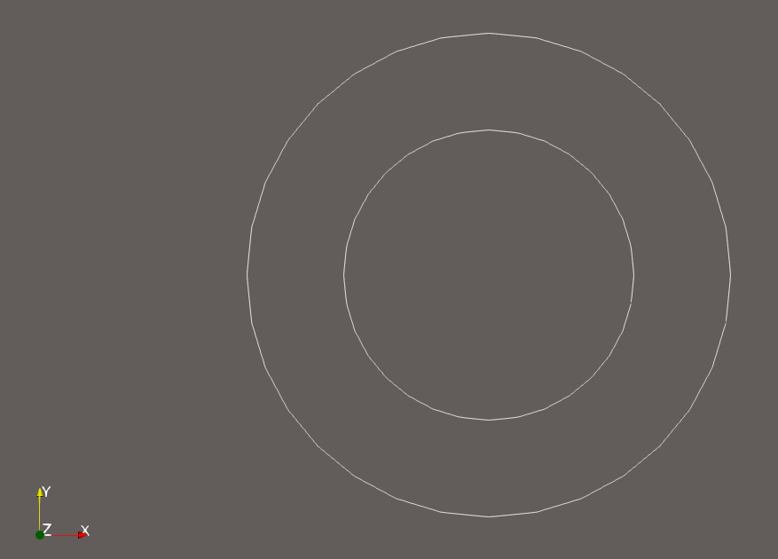
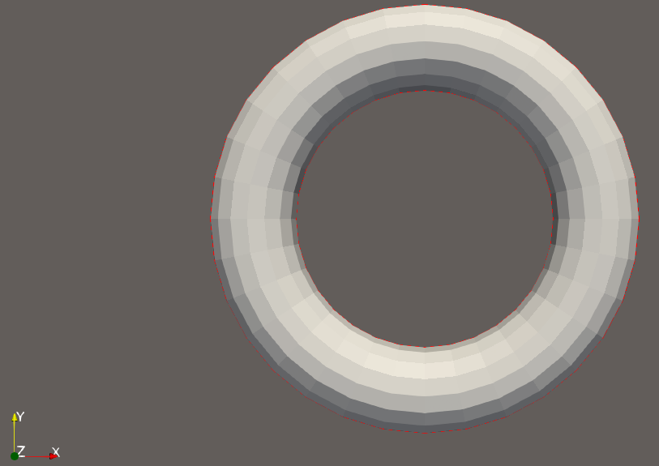
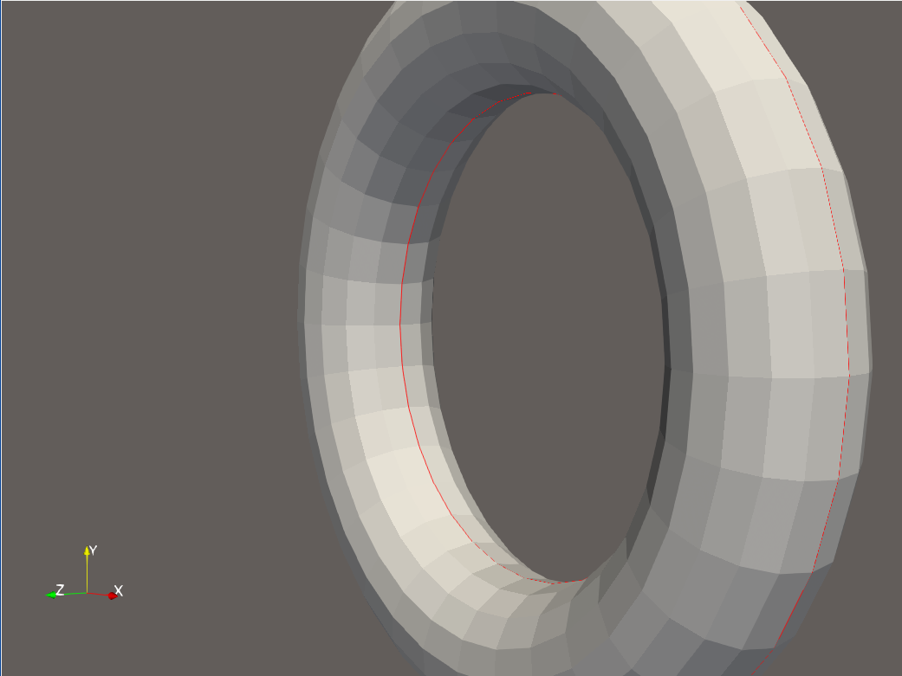

# Jacobi 集并行 CUDA 代码实现思路分析

## 1. 论文翻译

待补充。

## 2. 任务背景与代码目标

本项目对应课程要求中的第 2、3 项：在理解论文 `Jacobi Sets of Multiple Morse Functions` 的基础上，对照串行代码 `CODE/JacobiSetComputation-master`，开发对应的 CUDA 并行代码，并详细分析代码实现思路。

原串行项目已经实现了二维三角网格上两个 Morse 函数的 Jacobi 集计算。具体到当前实验代码，输入是三角网格，两个函数默认取顶点坐标：

- `f = y`
- `g = x`

程序输出 Jacobi 集对应的网格边，并写成 `*_jacobi.txt`。本项目的并行化目标不是重写整个网格库，而是围绕论文与串行代码中的核心计算步骤，提取最适合 GPU 并行的部分：**对所有内部边逐边判断其是否属于 Jacobi 集**。因此最终设计为：

- CPU 负责网格读取、拓扑预处理、边表构造和退化边 SoS 回退；
- GPU 负责大规模内部边的并行 Jacobi 判定；
- CPU 最后合并结果并写出与串行版本一致的结果文件。

这种设计属于典型的 CPU-GPU 异构并行：不将所有流程强行搬到 GPU，而是把计算密集、彼此独立的核心判定循环迁移到 CUDA kernel 中。

从课程作业角度看，代码实现需要体现三层对应关系。第一层是与论文思想对应，即 Jacobi 集不是普通几何曲线提取，而是由多个函数在流形上的临界关系诱导得到的结构；第二层是与串行代码对应，即并行程序不能脱离原项目的 `POS1`、`POS2`、`is_lowerLink` 等核心判定逻辑；第三层是与 GPU 并行模型对应，即需要找到串行算法中可拆分、无数据依赖、适合成批处理的计算单元。本项目最终选择“边”为并行粒度，正是因为在二维三角网格、两个函数的情形下，Jacobi 集判定天然可以归约到每条内部边上的局部判断。

因此，本报告分析的重点不是简单说明“使用了 CUDA”，而是说明为什么该算法能够按边并行、如何将串行数据结构转换为 GPU 可处理的数组、怎样在保持论文判定语义的同时处理浮点退化问题，以及如何通过对拍和可视化验证并行结果的正确性。

## 3. 串行老项目分析

### 3.1 工程结构与主要模块

串行工程位于 `CODE/JacobiSetComputation-master`，核心文件包括：

- `src/main.cpp`
  - 读取 mesh；
  - 调用 `need_edges()` 和 `need_neighbors()` 准备拓扑关系；
  - 构造两个函数数组 `f` 和 `g`；
  - 创建 `JacobiSet` 对象并调用 `compute()`；
  - 将结果写入 `*_jacobi.txt`。

- `include/TriMeshJ.h` 与 `src/TriMeshJ.cpp`
  - 在 `trimesh2` 的 `TriMesh` 基础上增加边集合 `edges`；
  - 提供 `need_edges()` 生成所有无向边；
  - 提供 `get_e_link()` 查找一条边的 link 中两个对顶点。

- `include/JacobiSet.h` 与 `src/JacobiSet.cpp`
  - 实现 Jacobi 集判定的核心逻辑；
  - 包括 `POS1`、`POS2`、`is_lowerLink`、`alignment`、`compute()`；
  - 支持 `USE_SOS`，在退化情况下使用 Simulation of Simplicity 进行精确符号判定。

从整体职责划分看，串行项目可以分成“网格拓扑层”和“Jacobi 判定层”。`TriMeshJ` 属于拓扑层，它并不关心 Morse 函数，也不判断 Jacobi 集，只负责把三角网格整理成后续算法需要的边和邻接关系。`JacobiSet` 属于算法层，它假设网格边、邻接和函数值已经准备好，然后围绕每条边执行 lower-link 判定。`main.cpp` 则是实验驱动层，负责把输入文件、默认函数构造和输出文件串联起来。

这种分层对后续并行化非常重要。由于拓扑层依赖 `trimesh2` 的复杂 C++ 数据结构，而算法层中的逐边判定只依赖少量整数索引和函数值，因此并行版本没有直接迁移整个 `TriMeshJ`，而是复用 CPU 拓扑层生成紧凑边表，再将边表交给 GPU 算法层处理。

### 3.2 网格边与 link 的构造

三角网格中的每条内部边通常被两个三角形共享。若边为 `(e1, e2)`，它相邻的两个三角形中各有一个非边端点，这两个点构成该边的 link，记为 `(v1, v2)`。

串行工程的 `TriMeshJ::need_edges()` 通过遍历每个三角形的三条边，使用 `std::set<Edge>` 去重后得到整张网格的边集合：

```cpp
for(int i = 0; i < nf; i++) {
for(int j = 0; j < 3; j++ ){
    edges.insert( create_edge(faces[i][(j+1)%3], faces[i][(j+2)%3]) );
}
}
```

`TriMeshJ::get_e_link()` 则通过两个端点的邻接表求公共邻居。公共邻居的前两个顶点即为该边的 link：

```cpp
const std::vector <int> &n1 = neighbors[v1];
const std::vector <int> &n2 = neighbors[v2];

for(int i = 0; i < n1.size(); i++){
    std::vector<int>::const_iterator iter = find(n2.begin(), n2.end(), n1[i]);
    if( iter != n2.end() ){
        if( va == -1 ){
            va = n1[i];
        }
        else if( vb == -1 ){
            vb = n1[i];
            break;
        }
    }
}
```

如果某条边不是内部边，可能找不到两个 link 顶点，代码会返回 `-1` 并在后续计算中跳过。

这里的 link 是理解该串行算法的关键。对二维三角网格而言，一条内部边通常被左右两个三角形共享。如果把当前边视为一个局部一维单纯形，那么这两个相邻三角形中不在边上的顶点就构成该边的局部邻域信息。Jacobi 判定并不需要扫描整张网格，而只需要知道这条边的两个端点和 link 中的两个顶点，就可以判断两个函数在该局部区域内是否发生临界关系。

这也解释了为什么边界边要跳过。边界边只有一个相邻三角形，link 中不能形成两个对顶点，缺少完整的局部两侧信息。若强行对边界边使用同样的判定，会破坏算法假设。因此串行代码通过 `v1 == -1 || v2 == -1` 过滤边界边，并行版本也继承了这一设计。

### 3.3 串行 Jacobi 判定流程

串行核心入口是 `JacobiSet::compute()`。其逻辑可以概括为：

1. 遍历所有边；
2. 取出边端点 `e1, e2`；
3. 调用 `get_e_link()` 得到两个 link 顶点 `v1, v2`；
4. 跳过边界边；
5. 分别判断 `v1` 和 `v2` 是否处在关于两个函数的 lower link 中；
6. 若满足临界条件，则将该边加入 Jacobi 集。

对应代码片段为：

```cpp
for(std::set<trimesh::Edge>::const_iterator iter = mesh->edges.begin(); iter != mesh->edges.end(); iter++){
    int e1 = iter->first;
    int e2 = iter->second;

    std::pair<int,int> lnk = mesh->get_e_link(*iter);
    int v1 = lnk.first;
    int v2 = lnk.second;

    if(v1 == -1 || v2 == -1)
        continue;

    bool f_lower_v1 = is_lowerLink(e1, e2, v1, g);
    bool f_lower_v2 = is_lowerLink(e1, e2, v2, g);
    bool g_lower_v1 = is_lowerLink(e1, e2, v1, f);
    bool g_lower_v2 = is_lowerLink(e1, e2, v2, f);

    bool f_crit = (f_lower_v1 == f_lower_v2);
    bool g_crit = (g_lower_v1 == g_lower_v2);

    if(f_crit){
        jacobiedges.push_back(JacobiEdge(e1, e2, !f_lower_v1, g_lower_v1, alignment(e1, e2)));
    }
}
```

从并行化角度看，这段循环有一个非常重要的特点：**每条边的判定只依赖该边端点、link 顶点和函数值，不依赖其他边的结果**。这意味着所有边可以彼此独立地计算，是天然适合 GPU 并行的 `O(E)` 任务，其中 `E` 是边数。

从算法语义上看，`f_lower_v1` 与 `f_lower_v2` 分别描述 link 中两个顶点相对于边 `(e1,e2)` 的 lower-link 分类。若二者相等，说明在该局部结构中相对于某个函数出现了临界关系。代码中同时计算 `f_crit` 和 `g_crit`，并在二者不一致时输出警告，这是为了检查两个函数判定在离散实现中的一致性。最终 `if(f_crit)` 将边加入 Jacobi 集，说明该边满足 Jacobi 判定条件。

值得注意的是，串行程序在找到 Jacobi 边时直接 `push_back` 到 `jacobiedges`。这种写法在 CPU 串行程序中很自然，因为任意时刻只有一个执行流修改 vector；但它不能直接搬到 GPU，因为多个线程同时追加会产生写冲突。并行版本后续采用“每条边一个固定输出槽位”的方式，正是为了解决这一串行数据结构与并行执行模型之间的差异。

### 3.4 POS1、POS2 与 lower link 判定

串行代码中 `is_lowerLink()` 是边判定的核心。它先对三元组 `(i, j, k)` 排序，再结合 `POS1` 和 `POS2` 判断顶点 `k` 是否位于边 `(i, j)` 相对于某个函数的 lower link 中。

`POS1` 使用两个函数值构造二维平面中的方向判定：

```cpp
double X = (f->at(a) * (g->at(v)-g->at(b))) +
           (f->at(b) * (g->at(a)-g->at(v))) +
           (f->at(v) * (g->at(b)-g->at(a)));

if( !are_equal(X, 0.0f) ) return (X > 0);
```

这实际上是在 `(f,g)` 函数值平面中判断三点的相对方向。当 `X` 非零时，符号直接决定结果；当 `X` 近似为 0 时，串行非 SoS 分支继续使用一系列 tie-break 条件保证结果可判定。

`POS2` 则用于某个单独标量函数上的大小比较：

```cpp
return are_equal(F[a], F[b]) ? (a < b) : (F[a] < F[b]);
```

若启用 `USE_SOS`，这些比较不再使用普通浮点近似，而会调用 SoS 库中的符号函数，例如：

- `sos_lambda3`
- `sos_smaller`
- `basic_isort3`

这保证了退化或近退化情况下结果的稳定性。

`POS1` 和 `POS2` 的作用可以理解为将连续理论中的“相对位置”和“上下关系”转化为离散可计算的布尔判定。`POS1` 中的 `X` 类似二维有向面积或行列式符号，它判断三个顶点在 `(f,g)` 函数值平面中的相对方向；`POS2` 则判断两个顶点在某一个函数上的先后关系。`is_lowerLink()` 将二者结合起来，最终判断一个 link 顶点是否属于边的 lower link。

退化问题是 Jacobi 集计算中必须认真处理的部分。例如多个顶点函数值相等、三个点在 `(f,g)` 平面中共线、边两端点在某个函数上没有严格大小关系，都可能导致普通浮点比较无法稳定决定符号。串行项目通过 `USE_SOS` 使用 Simulation of Simplicity，把这些退化情况转化为一致的符号扰动顺序。并行版本在 GPU 上没有完整重写 SoS，而是检测这些近退化信号并交给 CPU SoS 回退，这样可以在工程复杂度和正确性之间取得平衡。

### 3.5 串行版本的瓶颈与并行化空间

串行代码的整体流程包括读取网格、建立拓扑、遍历边、写结果。并不是所有步骤都适合 GPU 并行：

- 文件读取和写入是 I/O 操作，不适合放入 GPU；
- `trimesh2` 的拓扑结构是复杂 C++ 容器，不适合直接搬到 device 端；
- SoS 精确符号计算依赖第三方 CPU 库，也不适合直接移植到 CUDA。

真正适合并行化的是 `JacobiSet::compute()` 中的逐边判定部分。该部分具有以下特点：

- 计算对象数量大，随边数线性增长；
- 每条边计算流程相同；
- 每条边之间无数据依赖；
- 输出可按边下标独立写入。

因此，本项目选择将这部分改写为 CUDA kernel，是合理且针对核心算法的并行化。

从复杂度上看，若网格有 `E` 条边，串行版本需要执行约 `E` 次边判定，每次判定又包含多次 `is_lowerLink()`、`POS1()` 和 `POS2()`。随着网格规模增大，这一循环会成为计算主体。虽然 CPU 预处理和 I/O 也消耗时间，但它们不具备同样清晰的数据并行结构。将逐边判定迁移到 GPU 后，理论上可以把 `E` 次相互独立的局部判断分散到大量 CUDA 线程中执行，从而降低核心判定部分的执行时间。

也就是说，并行化的依据不是简单的代码行数占比，而是算法中可并行工作量的占比。Jacobi 集提取的核心是判断每条内部边是否属于结果集，本项目正是对这一部分进行 CUDA 化。

## 4. 论文算法理解与本项目问题映射

### 4.1 Jacobi 集的基本思想

论文 `Jacobi Sets of Multiple Morse Functions` 研究多个 Morse 函数在流形上的 Jacobi 集。直观地说，Jacobi 集描述的是多个函数的梯度方向发生相关、退化或临界关系的位置。对于两个函数 `f` 和 `g`，Jacobi 集可以理解为曲面上二者等值结构发生相互临界变化的点集。

在连续情形中，Jacobi 集通常与梯度相关性有关；在离散三角网格中，算法需要用组合拓扑方式表达“临界关系”。串行代码采用的实现方式是检查每条边在其 link 上的 lower-link 关系，从而判断该边是否属于 Jacobi 集。

论文的难点在于它讨论的是更一般的多个 Morse 函数以及更高维流形上的情形，而工程代码处理的是一个较具体但具有代表性的实例：二维三角网格上的两个标量函数。对于这一特例，Jacobi 集可以离散化为网格边集合。换言之，连续曲线在三角网格中不再以任意曲线形式出现，而是由一组满足条件的边来近似表示。

因此，理解本项目时不能只把输出看成“画出了两条圆”，而应看到背后的判定逻辑：这些圆由若干网格边组成，每条边是否被选中，都由两个函数在该边及其 link 上的组合临界关系决定。

### 4.2 从论文到二维三角网格实现

当前工程处理的是较具体的情形：

- 流形：二维三角网格；
- 函数数量：两个；
- 函数值：定义在顶点上；
- 输出：Jacobi 集对应的边集合。

在这个情形下，论文中的一般判定可以落到每条边的局部检查。对一条内部边 `(e1, e2)`，其 link 由两个顶点 `(v1, v2)` 构成。算法只需检查 `v1`、`v2` 关于两个函数的 lower link 分类是否满足临界条件。

这也是为什么串行代码中每条边只访问：

- `e1, e2`
- `v1, v2`
- `f[e1], f[e2], f[v1], f[v2]`
- `g[e1], g[e2], g[v1], g[v2]`

这组局部数据足以完成一次边判定。

这种局部性是离散算法的重要优势。连续情形中的梯度关系通常需要微分结构，而三角网格上只有顶点和边，因此算法转而使用函数值排序、方向符号和 lower-link 分类来表达临界性。对一条边而言，`e1,e2,v1,v2` 四个顶点构成一个最小局部环境，既包含边本身的信息，也包含边两侧三角形的信息。只要函数值定义在顶点上，就可以在这个局部环境中完成判定。

本项目默认使用 `f=y, g=x`，这使得 torus 示例具有较强对称性。最终 Jacobi 集表现为内外两圈闭合曲线，也与这种坐标函数选择有关。若更换为其他标量场，代码的判定流程不变，只是输入函数值不同，输出 Jacobi 集形状也会随之改变。

### 4.3 论文思想对并行化的启发

论文算法的局部性非常适合 CUDA。每条边的 Jacobi 判定只依赖该边的局部 star/link 信息，不需要全局迭代、不需要前后边之间同步，也不需要图遍历状态。因此本项目采用的 CUDA 映射为：

```text
内部边数组 index i  ->  CUDA thread i
```

每个线程独立执行一次与串行 `compute()` 中相同的判定流程。这样既保持论文算法本质，又充分利用 GPU 的大规模数据并行能力。

从 CUDA 设计角度看，这种映射非常直接：边表中的第 `i` 条边对应第 `i` 个线程，线程读取 `EdgeRecord[i]` 和函数数组 `f/g`，计算完成后写入 `Result[i]`。整个过程不需要线程间通信，也不需要 block 内共享内存同步。这样的并行结构简单、稳定，也便于和串行结果逐项对照。

如果强行并行化网格构建、邻接查找等步骤，虽然也可能提高某些阶段性能，但实现复杂度会显著增加，而且容易偏离课程任务的核心。相比之下，按照论文算法的局部判定特征提取 edge-level parallelism，更能体现对算法本质的理解。

## 5. mycode 并行代码与串行代码思路的区别

### 5.1 总体流程差异

串行版本流程：

```text
读取网格
  -> 建立 edges 和 neighbors
  -> for 每条边:
       get_e_link
       is_lowerLink
       若满足条件则 push_back 到 jacobiedges
  -> 写结果
```

并行版本流程：

```text
读取网格
  -> 建立 edges 和 neighbors
  -> CPU 预处理内部边表 EdgeRecord[]
  -> 将 EdgeRecord[]、f[]、g[] 拷贝到 GPU
  -> CUDA kernel: 每个线程处理一条边
  -> 将每条边结果拷回 CPU
  -> CPU 对退化边执行 SoS 回退
  -> 写结果
```

主要区别在于：串行版本在遍历过程中一边计算一边 `push_back` 结果；并行版本则先为每条边准备固定下标的输入和输出数组，使每个 GPU 线程可以独立写入 `results[i]`。这样避免了 GPU 多线程同时向同一个 vector 追加数据带来的竞争问题。

并行版本增加 CPU 预处理阶段并不是额外负担，而是为了把串行项目中面向对象、容器化的数据结构转化为 GPU 友好的线性数据。串行代码可以在循环中临时调用 `get_e_link()`，因为 CPU 访问 `std::set`、`std::vector`、邻接表都很方便；但 GPU kernel 更适合访问连续数组。如果在 kernel 中临时查找邻接关系，不仅需要把复杂拓扑结构迁移到 device，还会造成不规则访存和复杂控制流。因此，本项目把 link 计算提前放在 CPU 上完成，GPU 只接收已经整理好的边表。

这种设计让并行 kernel 专注于数值判定，而不是拓扑搜索。换言之，CPU 负责“准备每个线程要处理的任务”，GPU 负责“批量执行这些任务”。

### 5.2 数据结构差异

串行版本使用 `std::set<trimesh::Edge>` 存储边，遍历时动态调用 `get_e_link()`。这对 CPU 很自然，但不适合 GPU，因为：

- `std::set` 是树形结构，不适合连续内存访问；
- `TriMesh` 和邻接容器不能直接在 device 端使用；
- GPU kernel 需要简单、连续、可索引的数据。

因此并行版本新增 `EdgeRecord`：

```cpp
struct EdgeRecord {
    int e1;
    int e2;
    int link1;
    int link2;
};
```

每条内部边被展平成一个结构体，GPU 只需要通过边下标读取 `edges[idx]`，即可得到完整局部拓扑。

并行版本还新增 `JacobiGpuResult`：

```cpp
struct JacobiGpuResult {
    int fv1;
    int fv2;
    int min_f;
    int min_g;
    int pos_align;
    int is_jacobi;
    int degenerate;
};
```

串行版本的 `JacobiEdge` 只保存已判定为 Jacobi 集的边，而 GPU 版本为每条内部边都保存一个结果。这样可以避免并行追加问题，并且便于后续统计和 SoS 回退。

这里的差异体现了串行程序与并行程序在输出组织上的不同思维。串行程序倾向于动态收集结果，因为结果数量事先未知；并行程序更倾向于预分配与输入规模相同的结果数组，每个线程写入自己的位置。虽然这样会多保存一些非 Jacobi 边的状态，但换来了无锁、无原子操作、易于调试的并行写入模式。

此外，全量结果数组还为后续阶段提供了便利。程序可以统计 `degenerate_edges`，可以把退化边导出，也可以在 CPU SoS 回退时按原边下标覆盖对应结果。如果一开始就在 GPU 端压缩结果，虽然可能减少内存占用，但会引入 prefix-sum 或 atomic append 等额外并行算法，增加实现复杂度。

### 5.3 计算方式差异

串行版本：

- 单线程依次遍历边；
- 每遇到 Jacobi 边就 `push_back`；
- 若启用 SoS，则所有相关判断都走 SoS。

并行版本：

- GPU 中多个线程同时处理不同边；
- 每个线程写入固定位置 `results[idx]`；
- 普通边使用 double 精度 device 判定；
- 近退化边被标记后回到 CPU 端使用 SoS 精确覆盖。

这种混合方案不是削弱并行性，而是对不同任务采用合适的执行位置：

- 规则、数量多、无依赖的边判定交给 GPU；
- 数量少、逻辑复杂、依赖 CPU SoS 库的退化判定交给 CPU。

### 5.4 正确性策略差异

串行 SoS 版本以精确符号计算保证退化情形的稳定性。GPU 版本若完全重写 SoS，会带来较大工程复杂度，也可能引入新的不一致。因此本项目采用保守策略：

1. GPU 先执行非 SoS 分支的高性能判定；
2. 一旦遇到浮点近似相等或方向判定接近 0，就标记为 `degenerate`；
3. CPU 对这些边调用串行 `JacobiSet::is_lowerLink()` 和 `alignment()` 重新计算；
4. 用 SoS 回退结果覆盖 GPU 结果。

因此最终输出仍然可以与串行 SoS 版本保持一致。

这种正确性策略体现了“先快后准”的思路。GPU 对所有边进行快速初判，其中绝大多数普通边的浮点符号判定是稳定的；只有当检测到近似相等或方向接近退化时，才转入 CPU SoS。由于退化边数量通常远小于总边数，这种策略保留了 GPU 对大规模普通边的吞吐优势，同时避免了在 CUDA 中重新实现复杂 SoS 符号系统。

这也是本项目区别于简单 CUDA 改写的地方：如果只把非 SoS 分支搬到 GPU，虽然可以得到并行代码，但在退化数据上可能与串行参考不一致；如果完整移植 SoS 到 GPU，工作量又过大。本项目采用混合回退，使结果能够和串行 SoS 输出严格对拍。

## 6. mycode 代码详细分析

### 6.1 目录结构

并行代码位于 `CODE/mycode`，主要文件如下：

- `main_cuda.cpp`
  - CPU 端主程序；
  - 网格读取与边表预处理；
  - GPU 调用；
  - CPU SoS 回退；
  - 结果输出。

- `jacobi_cuda.cu`
  - CUDA device 函数；
  - CUDA kernel；
  - host 端 CUDA 内存管理与 kernel launch。

- `jacobi_gpu.h`
  - CPU/GPU 共享的数据结构；
  - `compute_jacobi_gpu()` 接口声明。

- `CMakeLists.txt`
  - 构建 CUDA 程序；
  - 链接 `trimesh2` 和 SoS。

- `build_cuda_wsl.sh`
  - WSL 下的一键构建脚本。

- `compare_jacobi.py`
  - 正确性对拍脚本。

- `benchmark_jacobi.py`
  - 性能测试脚本。

- `test_*.sh`
  - 各里程碑自动测试脚本。

- `DEVELOPMENT_LOG.md`
  - 开发过程记录。

### 6.2 `jacobi_gpu.h`：共享数据结构与 GPU 接口

`jacobi_gpu.h` 定义了 GPU 计算所需的核心数据结构。

`EdgeRecord` 保存一条内部边的完整局部拓扑：

```cpp
struct EdgeRecord {
    int e1;
    int e2;
    int link1;
    int link2;
};
```

其中：

- `e1, e2` 是边的两个端点；
- `link1, link2` 是这条边 link 中的两个对顶点。

这四个整数就是一条边判定所需的全部拓扑输入。相比直接把 `TriMesh` 传入 GPU，这种结构更简单、更连续、更适合 CUDA 访问。

`JacobiGpuResult` 保存每条边的输出：

```cpp
struct JacobiGpuResult {
    int fv1;
    int fv2;
    int min_f;
    int min_g;
    int pos_align;
    int is_jacobi;
    int degenerate;
};
```

其中：

- `fv1, fv2`：结果边的两个端点；
- `min_f, min_g, pos_align`：与串行 `JacobiEdge` 对应的属性；
- `is_jacobi`：该边是否属于 Jacobi 集；
- `degenerate`：该边是否触发近退化判断，需要 CPU SoS 回退。

`GpuTiming` 保存 GPU 时间：

```cpp
struct GpuTiming {
    float kernel_ms;
    float total_ms;
};
```

`compute_jacobi_gpu()` 是 CPU 端调用 GPU 的统一接口：

```cpp
bool compute_jacobi_gpu(const std::vector<EdgeRecord> &edges,
                        const std::vector<double> &f,
                        const std::vector<double> &g,
                        std::vector<JacobiGpuResult> *results,
                        GpuTiming *timing,
                        std::string *error_message);
```

这种接口设计把 CUDA 细节封装在 `.cu` 文件中，主程序只需要准备边表和函数数组即可。

从软件工程角度看，`jacobi_gpu.h` 也起到了模块边界的作用。CPU 侧不需要了解 kernel 的 grid/block 设置，也不需要直接管理 device 指针；CUDA 侧也不需要依赖 `TriMeshJ` 这类复杂类。二者之间只通过 `EdgeRecord`、函数值数组和 `JacobiGpuResult` 交换数据，降低了耦合度。

这种接口设计有利于后续扩展。例如如果以后要替换输入函数来源，只需要改变 `main_cuda.cpp` 中构造 `f/g` 的部分；如果要优化 kernel 或引入 device 端结果压缩，则主要修改 `jacobi_cuda.cu`，不必影响网格读取逻辑。

### 6.3 `main_cuda.cpp`：CPU 驱动与整体流程

`main_cuda.cpp` 是并行程序入口。它同时支持两种模式：

```text
./jacobi_cuda --preprocess-only <mesh.obj> [--dump-edges <edges.txt>]
./jacobi_cuda <mesh.obj> [--output <jacobi.txt>] [--dump-degenerate <edges.txt>]
```

#### 6.3.1 预处理模式

`--preprocess-only` 模式用于验证 CPU 端拓扑准备是否正确。代码会：

1. 读取 mesh；
2. 调用 `need_edges()`；
3. 调用 `need_neighbors()`；
4. 遍历 `mesh.edges`；
5. 调用 `get_e_link()`；
6. 过滤边界边；
7. 生成 `interior_edges`。

核心代码如下：

```cpp
trimesh::TriMeshJ mesh(mesh_file);
mesh.need_edges();
mesh.need_neighbors();

std::vector<EdgeRecord> interior_edges;
interior_edges.reserve(mesh.edges.size());

for (std::set<trimesh::Edge>::const_iterator it = mesh.edges.begin(); it != mesh.edges.end(); ++it) {
    std::pair<int, int> link = mesh.get_e_link(*it);
    if (link.first == -1 || link.second == -1) {
        continue;
    }

    EdgeRecord record;
    record.e1 = it->first;
    record.e2 = it->second;
    record.link1 = link.first;
    record.link2 = link.second;
    interior_edges.push_back(record);
}
```

这一步是串行工程与 CUDA 工程之间的数据桥梁。它将复杂的 `TriMeshJ` 拓扑转换为 GPU 能直接处理的扁平数组。

预处理阶段还承担了一个重要作用：保证 GPU 输入已经排除了边界边和非法 link。这样 kernel 内部不需要再处理 `-1` link 顶点，也不需要访问邻接表，只需假设每个 `EdgeRecord` 都是一条有效内部边。这减少了 device 端分支判断，降低了出错概率。

此外，预处理模式本身也是一个调试工具。通过 `--preprocess-only` 和 `--dump-edges`，可以在不运行 CUDA kernel 的情况下检查边表是否正确。如果后续 GPU 输出异常，可以先确认输入边表是否与串行拓扑一致，从而缩小问题范围。

#### 6.3.2 函数值构造

当前实验保持与串行 `main.cpp` 一致，使用顶点坐标构造两个函数：

```cpp
std::vector<double> f(mesh.vertices.size());
std::vector<double> g(mesh.vertices.size());
for (size_t i = 0; i < mesh.vertices.size(); ++i) {
    f[i] = mesh.vertices[i][1];
    g[i] = mesh.vertices[i][0];
}
```

即：

- `f = y`
- `g = x`

这样可以保证串行与并行版本输入完全一致。

#### 6.3.3 调用 GPU

主程序通过 `compute_jacobi_gpu()` 调用 CUDA 代码：

```cpp
std::vector<JacobiGpuResult> results;
GpuTiming timing;
std::string error;
if (!compute_jacobi_gpu(interior_edges, f, g, &results, &timing, &error)) {
    std::cerr << "GPU computation failed: " << error << "\n";
    return EXIT_FAILURE;
}
```

该接口返回每条内部边的判定结果，以及 GPU kernel 时间和 GPU 总时间。

这里将 GPU 调用封装成函数而不是直接写在 `main()` 中，是为了让主程序流程更加清晰：先准备输入，再调用计算，再处理结果。`error` 字符串用于返回 CUDA API 失败原因，例如内存分配失败、拷贝失败或 kernel launch 失败。这样比直接让程序崩溃更利于调试。

#### 6.3.4 SoS 回退

GPU 计算后，主程序会调用：

```cpp
const size_t sos_fallback_count = apply_sos_fallback(mesh, f, g, interior_edges, &results);
```

`apply_sos_fallback()` 会创建串行 `JacobiSet` 对象：

```cpp
JacobiSet js(&mesh, &f, &g);
```

由于 CMake 中定义了 `USE_SOS`，这个对象内部会初始化 SoS 矩阵。随后程序只遍历 `degenerate == 1` 的边，重新执行：

```cpp
const bool f_lower_v1 = js.is_lowerLink(edge.e1, edge.e2, edge.link1, &g);
const bool f_lower_v2 = js.is_lowerLink(edge.e1, edge.e2, edge.link2, &g);
const bool g_lower_v1 = js.is_lowerLink(edge.e1, edge.e2, edge.link1, &f);
const bool g_lower_v2 = js.is_lowerLink(edge.e1, edge.e2, edge.link2, &f);
```

然后覆盖 GPU 结果：

```cpp
out.min_f = !f_lower_v1;
out.min_g = g_lower_v1;
out.pos_align = js.alignment(edge.e1, edge.e2);
out.is_jacobi = f_crit;
out.degenerate = 1;
```

这样，普通边使用 GPU 结果，退化边使用串行 SoS 结果。

需要注意的是，SoS 回退不是重新计算所有边，而是只处理 GPU 标记出的退化边。这一点对性能和设计逻辑都很重要。若所有边都回到 CPU SoS 计算，则 GPU 并行化意义会大幅降低；若完全不回退，则退化情况下可能损失与串行参考的一致性。当前实现相当于把边分成两类：普通边走 GPU 快路径，退化边走 CPU 精确路径。

在 torus 测试中，退化边数量远小于总内部边数，这验证了混合策略的合理性。即使存在 SoS 初始化开销，核心判定仍然能够利用 GPU 完成大部分工作。

#### 6.3.5 结果输出

最终结果由 `write_jacobi_edges()` 写出，格式与串行版本一致：

```text
JacobiSet
<edge_count>
v1 x1 y1 z1 v2 x2 y2 z2
...
```

这种格式兼容已有可视化转换脚本，也方便与串行输出做文本或边集对比。

如果指定 `--dump-degenerate`，程序还会输出退化边列表：

```text
# edge_id e1 e2 link1 link2 is_jacobi
...
```

该文件主要用于调试和说明 SoS 回退的触发情况。

### 6.4 `jacobi_cuda.cu`：CUDA 核心实现

`jacobi_cuda.cu` 是并行化的核心文件。它包括两部分：

1. device 端判定函数；
2. host 端 CUDA 调用封装。

#### 6.4.1 device 版 `are_equal`

GPU 端使用固定阈值 `1e-12` 判断近似相等：

```cpp
constexpr double kEps = 1e-12;

__device__ bool device_are_equal(double a, double b) {
    double diff = a - b;
    if (diff < 0.0) {
        diff = -diff;
    }
    return diff < kEps;
}
```

与串行 `are_equal()` 类似，它用于识别浮点近似相等情况。一旦近似相等出现在关键判定中，GPU 会把该边标记为退化，交给 CPU SoS 重新计算。

#### 6.4.2 device 版 `POS1`

`device_pos1()` 复刻串行 `POS1()` 的非 SoS 逻辑：

```cpp
const double x =
    (f[a] * (g[v] - g[b])) +
    (f[b] * (g[a] - g[v])) +
    (f[v] * (g[b] - g[a]));

if (!device_are_equal(x, 0.0)) {
    return x > 0.0;
}
```

当 `x` 接近 0 时，说明三个点在 `(f,g)` 函数值平面中接近共线或存在退化情况。GPU 此时不会直接信任普通浮点判定，而是：

```cpp
*degenerate = 1;
```

并继续使用与串行非 SoS 分支一致的 tie-break 逻辑给出临时结果。这个临时结果保证 kernel 可以继续执行，但最终会在 CPU SoS 回退中被覆盖。

#### 6.4.3 device 版 `POS2`

`device_pos2()` 对单个函数值做大小比较：

```cpp
if (device_are_equal(field[a], field[b])) {
    *degenerate = 1;
    return a < b;
}
return field[a] < field[b];
```

若两个函数值近似相等，也标记为退化。

#### 6.4.4 device 版 `is_lower_link`

`device_is_lower_link()` 对应串行 `JacobiSet::is_lowerLink()`：

```cpp
int a = i;
int b = j;
int v = k;
device_sort3(&a, &b, &v);

const int index_i = (i == a) ? 0 : ((i == b) ? 1 : 2);
const int index_j = (j == a) ? 0 : ((j == b) ? 1 : 2);

const bool is_pos1 = device_pos1(a, b, v, f, g, degenerate);
bool is_pos2 = false;
if (index_j == (index_i + 1) % 3) {
    is_pos2 = device_pos2(i, j, field, degenerate);
} else {
    is_pos2 = device_pos2(j, i, field, degenerate);
}

return is_pos1 == is_pos2;
```

这段逻辑是论文 lower-link 判定在 GPU 上的直接实现，也是并行版本保持算法一致性的关键。

在这个函数中，`field` 参数用于区分当前是在相对于 `f` 还是 `g` 做 lower-link 判断。虽然 `POS1` 始终使用二维函数值 `(f,g)` 来判断方向，但 `POS2` 需要根据当前限制函数选择不同的标量数组。这一点对应串行代码中 `is_lowerLink(e1, e2, v, g)` 和 `is_lowerLink(e1, e2, v, f)` 的交替调用。

因此，GPU 版本不是简单比较坐标大小，而是完整复刻了串行 lower-link 组合判定流程。这样可以保证并行化改变的是执行方式，而不是数学判定规则。

#### 6.4.5 CUDA kernel：一线程一边

真正体现并行化的是 `compute_jacobi_kernel()`：

```cpp
const int idx = blockIdx.x * blockDim.x + threadIdx.x;
if (idx >= edge_count) {
    return;
}

const EdgeRecord edge = edges[idx];
```

每个线程取一个 `EdgeRecord`，然后执行与串行 `compute()` 对应的四次 lower-link 判定：

```cpp
const bool f_lower_v1 = device_is_lower_link(edge.e1, edge.e2, edge.link1, f, g, g, &degenerate);
const bool f_lower_v2 = device_is_lower_link(edge.e1, edge.e2, edge.link2, f, g, g, &degenerate);
const bool g_lower_v1 = device_is_lower_link(edge.e1, edge.e2, edge.link1, f, g, f, &degenerate);
const bool g_lower_v2 = device_is_lower_link(edge.e1, edge.e2, edge.link2, f, g, f, &degenerate);
```

随后计算临界条件：

```cpp
const bool f_crit = (f_lower_v1 == f_lower_v2);
const bool g_crit = (g_lower_v1 == g_lower_v2);
const bool is_jacobi = f_crit;
```

最后把结果写入固定下标：

```cpp
results[idx] = out;
```

这种写法没有多个线程同时写一个位置的问题，因此不需要原子操作。每个线程只写自己的 `results[idx]`，并行结构简单且稳定。

`block_size` 设为 256，这是一种常见的 CUDA 线程块配置。它能够在大多数 NVIDIA GPU 上取得较好的 occupancy，同时保持实现简单。`grid_size` 根据边数自动向上取整，因此无论输入网格有多少内部边，kernel 都能覆盖全部边。越界线程通过 `if (idx >= edge_count) return;` 直接退出。

该 kernel 的控制流虽然包含若干 `if` 分支，但每条边执行的整体流程基本一致，适合 SIMT 执行模型。由于每个线程只读取少量 `int` 和 `double`，并写回一个结果结构体，内存访问模式也相对清晰。当前实现使用 AoS 形式的 `EdgeRecord`，主要考虑代码可读性和与 CPU 预处理结果对应；若进一步优化性能，也可以改成 SoA 形式分别存储 `e1/e2/link1/link2`。

#### 6.4.6 host 端 CUDA 封装

`compute_jacobi_gpu()` 负责 CUDA 内存管理和 kernel 调用。主要步骤包括：

1. 分配 device 内存：

```cpp
cudaMalloc(&d_edges, edges.size() * sizeof(EdgeRecord));
cudaMalloc(&d_f, f.size() * sizeof(double));
cudaMalloc(&d_g, g.size() * sizeof(double));
cudaMalloc(&d_results, edges.size() * sizeof(JacobiGpuResult));
```

2. 将输入拷贝到 GPU：

```cpp
cudaMemcpy(d_edges, edges.data(), ..., cudaMemcpyHostToDevice);
cudaMemcpy(d_f, f.data(), ..., cudaMemcpyHostToDevice);
cudaMemcpy(d_g, g.data(), ..., cudaMemcpyHostToDevice);
```

3. 设置线程块大小：

```cpp
const int block_size = 256;
const int grid_size = static_cast<int>((edges.size() + block_size - 1) / block_size);
```

4. 启动 kernel：

```cpp
compute_jacobi_kernel<<<grid_size, block_size>>>(...);
```

5. 拷回结果：

```cpp
cudaMemcpy(results->data(), d_results, ..., cudaMemcpyDeviceToHost);
```

6. 释放资源。

函数还使用 `cudaEvent` 记录 `kernel_ms` 和 `total_ms`，便于性能分析。

这里区分 `kernel_ms` 和 `total_ms` 很有必要。`kernel_ms` 只表示 CUDA kernel 在 GPU 上执行核心逐边判定的时间；`total_ms` 则包含 device 内存分配、host-to-device 拷贝、kernel 执行、device-to-host 拷贝等 GPU 调用相关开销。实验结果中可以看到，kernel 时间通常远小于端到端时间，这说明核心判定确实被 GPU 快速执行，而整体耗时还受到 CPU 预处理、I/O 和 SoS 回退影响。

`compute_jacobi_gpu()` 还对 CUDA API 调用逐步检查错误。如果 `cudaMalloc`、`cudaMemcpy` 或 kernel launch 失败，函数会返回 `false` 并写入错误信息。这样的错误处理比忽略返回值更可靠，也便于在实验环境配置不正确时快速定位问题。

### 6.5 `CMakeLists.txt` 与构建脚本

`CODE/mycode/CMakeLists.txt` 启用了 C++ 和 CUDA：

```cmake
project(JacobiCuda LANGUAGES CXX CUDA)
```

并加入以下源文件：

- `main_cuda.cpp`
- `jacobi_cuda.cu`
- 串行工程的 `TriMeshJ.cpp`
- 串行工程的 `JacobiSet.cpp`

同时链接：

- `trimesh2/lib.Linux64/libtrimesh.a`
- `Detri_2.6.a/build/lib/libSoS.a`
- `OpenMP::OpenMP_CXX`

并定义：

```cmake
target_compile_definitions(jacobi_cuda PRIVATE USE_SOS)
```

这保证 CPU 回退使用 SoS 分支。

`build_cuda_wsl.sh` 封装了构建命令：

```bash
cmake -S "${SCRIPT_DIR}" -B "${BUILD_DIR}" -DCMAKE_BUILD_TYPE=Release
cmake --build "${BUILD_DIR}" -j"$(nproc)"
```

这样用户只需在 WSL 中执行脚本即可构建 CUDA 程序。

构建文件中同时包含串行工程的 `TriMeshJ.cpp` 和 `JacobiSet.cpp`，这是因为并行版本并不是完全独立的玩具程序，而是复用原项目的拓扑和 SoS 逻辑。`TriMeshJ.cpp` 提供边和 link 的生成能力，`JacobiSet.cpp` 提供 CPU SoS 回退能力。链接 `libtrimesh.a` 和 `libSoS.a` 则保证这些功能可以在新的 CUDA 可执行文件中使用。

`CMAKE_CUDA_ARCHITECTURES` 设置为 `75 86`，是为了兼容当前 CUDA Toolkit 与 RTX 4060 环境。虽然 RTX 4060 属于更新架构，但 CUDA 12.0 对部分最新架构标识支持有限，因此使用兼容架构设置可以避免构建失败，同时仍能在目标 GPU 上正常运行。

### 6.6 `compare_jacobi.py`：正确性对拍

`compare_jacobi.py` 用于比较串行输出和 GPU 输出。它不直接比较文本顺序，而是读取每条 Jacobi 边的两个顶点编号，并规范化为 `(min,max)`：

```python
a = int(parts[0])
b = int(parts[4])
if a > b:
    a, b = b, a
edges.add((a, b))
```

这样即使未来 GPU 输出顺序发生变化，只要边集合一致，也会判定为正确。

脚本输出：

```text
reference_edges: ...
candidate_edges: ...
match: yes
```

如果存在差异，会输出 missing 和 extra 边，便于定位错误。

这个脚本的意义不仅是自动化测试，也体现了并行程序验证时应避免过度依赖输出顺序。串行程序按 `std::set` 顺序遍历边，因此输出顺序稳定；GPU 程序当前也保留了边下标顺序，但未来如果采用并行压缩或异步写出，顺序可能改变。只要 Jacobi 边集合相同，算法结果就应认为一致。因此使用集合比较比直接文本比较更具有鲁棒性。

### 6.7 `benchmark_jacobi.py`：性能测试

`benchmark_jacobi.py` 自动完成性能测试流程：

1. 调用 `mesh_make` 生成不同规模 torus；
2. 调用串行 `JacobiSetComputation`；
3. 调用 CUDA hybrid 版本；
4. 使用 `compare_jacobi.py` 的读取逻辑对拍结果；
5. 写出 CSV。

核心流程为：

```python
run_command([str(MESH_MAKE), "torus", str(u), str(v), str(mesh)], cwd=JS_DIR)
cpu_output, cpu_wall_ms = run_command([str(CPU_EXE), str(mesh)], cwd=JS_DIR / "build")
gpu_output, gpu_wall_ms = run_command([str(GPU_EXE), str(mesh), "--output", str(gpu_out)], cwd=SCRIPT_DIR)
```

CSV 字段包括：

- `vertices`
- `edges`
- `jacobi_edges`
- `degenerate_edges`
- `sos_fallback_edges`
- `cpu_wall_ms`
- `gpu_wall_ms`
- `gpu_kernel_ms`
- `gpu_total_ms`
- `speedup_wall`
- `match`

该脚本为后续报告中的性能分析提供数据来源。

`benchmark_jacobi.py` 同时承担正确性和性能两类任务。每个规模都不仅记录时间，还会调用边集比较逻辑确认 `match=yes`。这样可以避免只展示加速比而忽略正确性的问题。对于并行算法来说，速度提升只有在结果正确的前提下才有意义。

脚本输出的 `cpu_wall_ms` 和 `gpu_wall_ms` 是从进程调用层面测得的端到端时间，因此包含文件读取、预处理和写出等开销；`gpu_kernel_ms` 和 `gpu_total_ms` 则来自程序内部 CUDA event 统计。报告中同时展示这两类时间，可以更准确地解释为什么小规模时端到端不加速，而 kernel 本身仍然很快。

### 6.8 测试脚本设计

`CODE/mycode` 中还包含多个阶段性测试脚本：

- `test_preprocess.sh`
  - 测试 CPU 边表预处理；
  - 检查 torus 的顶点、边、面、内部边数量。

- `test_gpu_basic.sh`
  - 测试 GPU 基础判定；
  - 检查 Jacobi 边数是否为 64。

- `test_degenerate_dump.sh`
  - 测试退化边导出；
  - 检查退化边数量是否为 16。

- `test_sos_fallback.sh`
  - 测试 SoS 回退；
  - 检查 `sos_fallback_edges`。

- `test_compare_jacobi.sh`
  - 测试串行与 GPU 输出对拍。

- `test_benchmark_smoke.sh`
  - 测试性能脚本能否生成 CSV，并保证 `match=yes`。

这些脚本体现了分阶段开发的思路：先验证输入预处理，再验证 GPU kernel，再验证退化处理，最后验证整体正确性和性能。

这种分阶段测试方式降低了调试难度。如果最终输出错误，单独的测试脚本可以帮助判断问题来自哪个阶段：若 `test_preprocess.sh` 失败，说明边表输入有问题；若 `test_gpu_basic.sh` 失败，说明 kernel 判定或 CUDA 调用有问题；若 `test_sos_fallback.sh` 失败，说明退化回退合并有问题；若 `test_compare_jacobi.sh` 失败，则说明整体结果与串行参考不一致。相比最后只运行一个总测试，这种方式更适合复杂算法的迭代开发。

## 7. 并行化实现的合理性与局限

### 7.1 为什么不是全流程 GPU 化

本项目没有把网格读取、邻接构建、SoS 库整体迁移到 GPU，原因是这些部分并不是最适合 GPU 的计算：

- 网格读取和结果输出属于 I/O；
- `trimesh2` 内部使用复杂 C++ 容器，不适合直接传入 device；
- SoS 是 CPU 符号计算库，完整移植成本高且容易引入不一致。

因此项目采用更稳妥的混合方案：

```text
CPU: mesh 读取 + 拓扑预处理 + SoS 回退
GPU: 内部边并行 Jacobi 判定
```

这个方案并没有削弱并行化重点，因为 Jacobi 集计算的核心循环正是逐边判定。对边数较大的网格，这一部分具有明显的数据并行特征。

在 GPU 编程中，合理的异构划分往往比“全部放到 GPU”更重要。GPU 擅长处理大量结构相同、控制流相对一致的数值任务，而 CPU 更适合处理复杂分支、文件系统、动态容器和第三方库调用。本项目将拓扑整理和 SoS 留在 CPU，把重复的边判定放在 GPU，符合两类处理器的特点。

如果强行将 `trimesh2` 的邻接结构迁移到 GPU，需要重新设计图结构存储、邻接压缩和边界处理；如果强行将 SoS 库迁移到 GPU，则需要重写大量符号计算逻辑。这些工作不仅超出课程项目范围，也可能使最终结果难以与原串行代码保持一致。

### 7.2 并行化占比说明

从代码量看，CPU 端仍然承担了不少工作；但从算法结构看，最核心的 `O(E)` 判定循环已经被放入 CUDA kernel。

串行代码中最重要的循环是：

```cpp
for(edge in mesh->edges) {
    is_lowerLink(...);
}
```

并行版本中对应为：

```cpp
idx = blockIdx.x * blockDim.x + threadIdx.x;
edge = edges[idx];
device_is_lower_link(...);
```

因此并行化发生在算法核心，而不是仅仅并行文件处理或辅助步骤。

从实验结果也可以看出，GPU kernel 时间随着规模增大仍保持较低水平，说明逐边判定部分在 GPU 上执行效率较高。端到端加速比没有达到非常高，主要是因为 CPU 预处理、文件 I/O、数据传输和 SoS 初始化仍然存在。但这并不否定并行化价值，而是说明当前程序属于保守可靠的 hybrid 实现。若未来进一步优化 CPU 预处理或减少数据传输，整体加速仍有提升空间。

### 7.3 当前实现局限

当前实现仍有一些可以改进的地方：

1. CPU 预处理仍是串行或依赖 `trimesh2` 内部实现；
2. GPU 输出结果采用全量数组，未做 device 端 compaction；
3. SoS 回退在 CPU 上执行，退化边较多时会影响端到端性能；
4. benchmark 中 `gpu_wall_ms` 包含 CPU 预处理、文件 I/O、SoS 初始化、数据传输等，不等同于纯 kernel 时间；
5. 当前函数默认仍是 `f=y, g=x`，若要支持任意外部标量场，还需扩展输入读取接口。

这些局限不影响课程要求中的“对应并行 CUDA 代码”目标，但可以作为报告中的进一步工作方向。

进一步优化可以从几个方向展开。第一，可以将边表构造后的数据长期保留，避免多次 benchmark 中反复读取和预处理网格；第二，可以将 `EdgeRecord` 改为 SoA 布局，提高大规模连续访存效率；第三，可以在 GPU 端实现并行 compact，只输出 Jacobi 边，减少 CPU 回收结果的体积；第四，可以对退化边建立更精细的分类，只在真正影响最终结果时执行 SoS 回退；第五，可以扩展输入接口，支持从外部文件读取任意标量场，而不是固定使用 `f=y, g=x`。

这些改进方向说明当前实现已经具备清晰的算法框架：CPU 预处理、GPU 判定、CPU 精确回退、结果验证。后续优化主要是在该框架内提升性能和通用性。

## 8. 测试与结果验证

### 8.1 环境验证

环境验证的目标是确认 CUDA 编译器、NVIDIA GPU 驱动以及本项目的 CUDA 程序构建流程均可正常工作。测试在 WSL Ubuntu 环境中进行，首先进入并行代码目录：

```bash
cd "/mnt/d/金介然/大三下/gpu/大作业/CODE/mycode"
```

#### 8.1.1 CUDA 编译器验证

执行：

```bash
nvcc --version
```

输出如下：

```text
nvcc: NVIDIA (R) Cuda compiler driver
Copyright (c) 2005-2023 NVIDIA Corporation
Built on Fri_Jan__6_16:45:21_PST_2023
Cuda compilation tools, release 12.0, V12.0.140
Build cuda_12.0.r12.0/compiler.32267302_0
```

说明 WSL 中已安装 CUDA Toolkit，且 `nvcc` 编译器可用。本项目后续 CUDA 代码均使用该编译器构建。

#### 8.1.2 GPU 运行环境验证

执行：

```bash
nvidia-smi
```

输出显示：

```text
NVIDIA-SMI 580.105.07
Driver Version: 581.80
CUDA Version: 13.0
GPU Name: NVIDIA GeForce RTX 4060
```

可以看到 WSL 能够正确识别 NVIDIA GeForce RTX 4060，说明 GPU 已经透传到 WSL 环境中。`nvidia-smi` 中显示的 CUDA Version 为驱动支持的最高 CUDA 运行时版本，而 `nvcc --version` 显示的是实际安装的 CUDA Toolkit 版本。驱动版本高于 Toolkit 版本是正常情况，能够向下兼容 CUDA 12.0 编译生成的程序。

进入 WSL 时出现提示：

```text
wsl: 检测到 localhost 代理配置，但未镜像到 WSL。NAT 模式下的 WSL 不支持 localhost 代理。
```

该提示与 CUDA 编译运行无关，只表示 Windows 侧 localhost 代理没有自动映射到 WSL。本次测试中 `nvcc`、`nvidia-smi` 和构建过程均正常，因此该提示不影响本项目运行。

#### 8.1.3 项目构建验证

执行：

```bash
bash build_cuda_wsl.sh
```

输出如下：

```text
-- Configuring done (0.1s)
-- Generating done (0.2s)
-- Build files have been written to: /mnt/d/金介然/大三下/gpu/大作业/CODE/mycode/build
[100%] Built target jacobi_cuda
Built: /mnt/d/金介然/大三下/gpu/大作业/CODE/mycode/build/jacobi_cuda
```

构建过程成功生成 `build/jacobi_cuda` 可执行文件，说明 CMake、C++ 编译器、CUDA 编译器、`trimesh2` 静态库以及 SoS 静态库均能正确协同工作。

综上，CUDA 并行程序的开发与运行环境验证通过。

### 8.2 功能正确性验证

功能正确性验证按模块逐步进行，目标是分别确认 CPU 预处理、GPU 基础计算、退化边导出和 SoS 回退均能正常工作。测试均在 `CODE/mycode` 目录下执行：

```bash
cd "/mnt/d/金介然/大三下/gpu/大作业/CODE/mycode"
```

#### 8.2.1 CPU 预处理验证

执行：

```bash
bash test_preprocess.sh
```

输出如下：

```text
Reading /mnt/d/金介然/大三下/gpu/大作业/CODE/JacobiSetComputation-master/test_torus.obj... Done.
Computing edges... Done. in 0.169000 msec.
Finding vertex neighbors... Done.
mesh: /mnt/d/金介然/大三下/gpu/大作业/CODE/JacobiSetComputation-master/test_torus.obj
vertices: 512
edges: 1536
faces: 1024
interior_edges: 1536
```

该结果说明程序能够正确读取 `test_torus.obj`，并得到：

- 顶点数：512；
- 边数：1536；
- 面数：1024；
- 内部边数：1536。

对于该 torus 网格，所有边都是内部边，因此 `interior_edges` 与 `edges` 数量一致。该测试验证了 CPU 端边表预处理逻辑正确。

#### 8.2.2 GPU 基础计算验证

执行：

```bash
bash test_gpu_basic.sh
```

输出如下：

```text
vertices: 512
edges: 1536
faces: 1024
interior_edges: 1536
 -------------- Creating SOS Matrix ........... (#fix=15.14) scale = 0.000000000000010
SoS: matrix[512,2] @ 5 Lia digits; lia_length (10); 0.047 Mb.
jacobi_edges: 64
degenerate_edges: 16
sos_fallback_edges: 16
gpu_kernel_ms: 1.10797
gpu_total_ms: 5.44378
output: /tmp/test_torus_gpu_jacobi.txt
```

该测试说明 CUDA 程序能够完成 Jacobi 集计算，并在 torus 示例上得到 64 条 Jacobi 边。`gpu_kernel_ms` 表示 CUDA kernel 本身的运行时间，`gpu_total_ms` 表示包括 GPU 内存分配、数据传输、kernel 执行和结果拷回在内的 GPU 调用时间。

输出中的 `degenerate_edges: 16` 表示 GPU 判定过程中有 16 条边触发近退化条件。`sos_fallback_edges: 16` 表示这些边均被 CPU SoS 分支重新计算并覆盖结果。

#### 8.2.3 退化边导出验证

执行：

```bash
bash test_degenerate_dump.sh
```

输出如下：

```text
vertices: 512
edges: 1536
faces: 1024
interior_edges: 1536
 -------------- Creating SOS Matrix ........... (#fix=15.14) scale = 0.000000000000010
SoS: matrix[512,2] @ 5 Lia digits; lia_length (10); 0.047 Mb.
jacobi_edges: 64
degenerate_edges: 16
sos_fallback_edges: 16
gpu_kernel_ms: 0.801792
gpu_total_ms: 3.34326
output: /tmp/test_torus_gpu_jacobi.txt
degenerate_dump: /tmp/test_torus_degenerate_edges.txt
```

该测试验证了 `--dump-degenerate` 功能。程序不仅能够统计退化边数量，还能将退化边列表写入 `/tmp/test_torus_degenerate_edges.txt`，为调试和分析 SoS 回退提供依据。

#### 8.2.4 SoS 回退验证

执行：

```bash
bash test_sos_fallback.sh
```

输出如下：

```text
vertices: 512
edges: 1536
faces: 1024
interior_edges: 1536
 -------------- Creating SOS Matrix ........... (#fix=15.14) scale = 0.000000000000010
SoS: matrix[512,2] @ 5 Lia digits; lia_length (10); 0.047 Mb.
jacobi_edges: 64
degenerate_edges: 16
sos_fallback_edges: 16
gpu_kernel_ms: 0.959488
gpu_total_ms: 4.23072
output: /tmp/test_torus_gpu_sos_jacobi.txt
```

该结果说明 CPU SoS 回退机制正常工作。GPU 标记出的 16 条退化边均被回退到串行 SoS 逻辑重新计算，最终输出文件为 `/tmp/test_torus_gpu_sos_jacobi.txt`。

#### 8.2.5 小结

以上四个功能测试分别覆盖了：

- CPU 拓扑预处理；
- GPU 并行 Jacobi 判定；
- 退化边检测与导出；
- CPU SoS 精确回退。

测试结果表明，并行程序的各个功能模块均可正常工作，且在标准 torus 示例上得到的 Jacobi 边数为 64，与串行参考结果一致。

### 8.3 串行与并行输出对拍

本节用于验证并行程序最终输出是否与串行参考程序一致。由于 CUDA 并行程序内部采用“每条边对应一个结果槽位”的方式，理论上未来如果进一步改为 GPU 端压缩输出，输出顺序可能发生变化，因此本项目同时使用两种方式验证：

1. 使用 `compare_jacobi.py` 做顺序无关的边集比较；
2. 使用 `diff` 直接比较当前输出文件内容。

#### 8.3.1 边集对拍

执行：

```bash
cd "/mnt/d/金介然/大三下/gpu/大作业/CODE/mycode"
bash test_compare_jacobi.sh
```

输出如下：

```text
Reading /mnt/d/金介然/大三下/gpu/大作业/CODE/JacobiSetComputation-master/test_torus.obj... Done.
Computing edges... Done. in 0.145000 msec.
Finding vertex neighbors... Done.
mesh: /mnt/d/金介然/大三下/gpu/大作业/CODE/JacobiSetComputation-master/test_torus.obj
vertices: 512
edges: 1536
faces: 1024
interior_edges: 1536
 -------------- Creating SOS Matrix ........... (#fix=15.14) scale = 0.000000000000010
SoS: matrix[512,2] @ 5 Lia digits; lia_length (10); 0.047 Mb.
jacobi_edges: 64
degenerate_edges: 16
sos_fallback_edges: 16
gpu_kernel_ms: 0.856064
gpu_total_ms: 3.74022
output: /tmp/test_torus_gpu_sos_jacobi.txt
reference_edges: 64
candidate_edges: 64
match: yes
```

其中：

- `reference_edges: 64` 表示串行参考结果中有 64 条 Jacobi 边；
- `candidate_edges: 64` 表示 GPU+SoS 并行结果中也有 64 条 Jacobi 边；
- `match: yes` 表示两者边集完全一致。

`compare_jacobi.py` 对每条边只比较顶点编号，并将 `(a,b)` 规范化为小编号在前，因此比较过程不依赖输出顺序。这说明即使并行程序未来改变输出顺序，只要计算得到的 Jacobi 边集合一致，该测试仍能正确验证结果。

#### 8.3.2 文本文件直接比较

执行：

```bash
diff -u "../JacobiSetComputation-master/test_torus_jacobi.txt" /tmp/test_torus_gpu_sos_jacobi.txt
```

该命令没有任何输出。对于 `diff` 而言，无输出表示两个文件内容完全一致。也就是说，当前并行程序生成的 `/tmp/test_torus_gpu_sos_jacobi.txt` 不仅在边集合上与串行参考一致，而且在文本内容和输出顺序上也与串行文件一致。

#### 8.3.3 小结

串行与并行输出对拍结果表明：

- 串行参考结果：64 条 Jacobi 边；
- CUDA hybrid 结果：64 条 Jacobi 边；
- 顺序无关边集比较：`match: yes`；
- `diff` 文本比较：无差异。

因此，在 torus 标准测试数据上，GPU 并行计算结合 CPU SoS 回退后，最终输出与串行 SoS 版本完全一致。

### 8.4 性能测试与加速比分析

性能测试用于观察串行版本与 CUDA hybrid 版本在不同网格规模下的耗时变化。测试脚本为 `benchmark_jacobi.py`，其流程为：

1. 使用 `mesh_make` 自动生成 torus 网格；
2. 运行串行 `JacobiSetComputation`；
3. 运行 CUDA hybrid 版本；
4. 使用 `compare_jacobi.py` 对拍输出；
5. 将耗时、Jacobi 边数、退化边数、加速比写入 CSV。

#### 8.4.1 benchmark 冒烟测试

首先执行小规模冒烟测试：

```bash
cd "/mnt/d/金介然/大三下/gpu/大作业/CODE/mycode"
bash test_benchmark_smoke.sh
```

输出如下：

```text
32x16: cpu_wall=78.414 ms, gpu_wall=312.563 ms, speedup=0.251x, match=yes
wrote: /tmp/jacobi_benchmark_smoke.csv
```

该测试说明 benchmark 脚本可以正常生成网格、运行串行与并行程序、完成正确性对拍并输出 CSV。`match=yes` 表示该规模下 GPU 输出与串行输出一致。

#### 8.4.2 多规模性能测试

执行：

```bash
python3 benchmark_jacobi.py --sizes 32x16,64x32,128x64,256x128,512x256 --output /tmp/jacobi_benchmark.csv
cat /tmp/jacobi_benchmark.csv
```

终端输出如下：

```text
32x16: cpu_wall=45.496 ms, gpu_wall=273.897 ms, speedup=0.166x, match=yes
64x32: cpu_wall=93.851 ms, gpu_wall=247.151 ms, speedup=0.380x, match=yes
128x64: cpu_wall=190.336 ms, gpu_wall=287.831 ms, speedup=0.661x, match=yes
256x128: cpu_wall=519.644 ms, gpu_wall=464.860 ms, speedup=1.118x, match=yes
512x256: cpu_wall=1802.050 ms, gpu_wall=1115.213 ms, speedup=1.616x, match=yes
wrote: /tmp/jacobi_benchmark.csv
```

CSV 内容如下：

```text
u,v,vertices,edges,jacobi_edges,degenerate_edges,sos_fallback_edges,cpu_wall_ms,gpu_wall_ms,gpu_kernel_ms,gpu_total_ms,speedup_wall,match
32,16,512,1536,64,16,16,45.496,273.897,0.963584,4.374850,0.166,yes
64,32,2048,6144,128,32,32,93.851,247.151,0.856064,3.649280,0.380,yes
128,64,8192,24576,256,64,64,190.336,287.831,1.000450,3.816610,0.661,yes
256,128,32768,98304,512,128,128,519.644,464.860,1.132030,4.999230,1.118,yes
512,256,131072,393216,1024,260,260,1802.050,1115.213,1.094500,6.059900,1.616,yes
```

为便于阅读，整理如下：

| 网格规模 | 顶点数 | 边数 | Jacobi 边数 | 退化边数 | CPU 总时间(ms) | GPU 端到端时间(ms) | GPU kernel(ms) | 加速比 | 对拍 |
| --- | ---: | ---: | ---: | ---: | ---: | ---: | ---: | ---: | --- |
| 32x16 | 512 | 1536 | 64 | 16 | 45.496 | 273.897 | 0.963584 | 0.166x | yes |
| 64x32 | 2048 | 6144 | 128 | 32 | 93.851 | 247.151 | 0.856064 | 0.380x | yes |
| 128x64 | 8192 | 24576 | 256 | 64 | 190.336 | 287.831 | 1.000450 | 0.661x | yes |
| 256x128 | 32768 | 98304 | 512 | 128 | 519.644 | 464.860 | 1.132030 | 1.118x | yes |
| 512x256 | 131072 | 393216 | 1024 | 260 | 1802.050 | 1115.213 | 1.094500 | 1.616x | yes |

#### 8.4.3 结果分析

从正确性看，所有规模的 `match` 均为 `yes`，说明不同规模下 CUDA hybrid 输出都与串行输出一致。

从性能看，小规模网格下 GPU 端到端时间高于 CPU。例如 `32x16` 时，CPU 时间为 `45.496 ms`，GPU 端到端时间为 `273.897 ms`，加速比只有 `0.166x`。这是合理现象，原因是小规模计算量较小，GPU kernel 本身虽然只需约 `0.96 ms`，但程序整体还包含：

- 网格读取；
- CPU 拓扑预处理；
- CUDA 内存分配；
- CPU 到 GPU 数据传输；
- GPU 到 CPU 结果拷回；
- SoS 矩阵初始化与退化边回退；
- 进程启动与文件输出。

这些固定开销在小规模下占主导，因此端到端加速不明显。

随着网格规模增大，逐边判定的计算量增加，GPU 并行优势开始体现。`256x128` 网格时，GPU 端到端时间为 `464.860 ms`，CPU 时间为 `519.644 ms`，加速比达到 `1.118x`。到 `512x256` 网格时，CPU 时间为 `1802.050 ms`，GPU 端到端时间为 `1115.213 ms`，加速比达到 `1.616x`。

还可以观察到，GPU kernel 时间始终约为 1 ms 左右，即使在 `512x256` 的 393216 条边规模下，核心判定 kernel 仍然只需约 `1.09 ms`。这说明真正被并行化的逐边 Jacobi 判定在 GPU 上执行效率很高。端到端时间主要受 CPU 预处理、I/O、数据传输和 SoS 回退等非 kernel 部分影响。

#### 8.4.4 小结

性能测试表明：

- CUDA hybrid 版本在所有测试规模下均保持正确性；
- 小规模时由于固定开销较大，端到端速度慢于串行；
- 随着边数增大，GPU 并行判定优势逐渐显现；
- 在 `512x256` 网格上，端到端加速比达到 `1.616x`；
- GPU kernel 本身耗时很低，说明核心逐边判定已经被有效并行化。

### 8.5 可视化验证

可视化验证用于确认输出的 Jacobi 集在几何形态上符合预期。由于程序输出的是 `*_jacobi.txt` 文本格式，需要先转换为 ParaView 可读取的 VTK 文件。

#### 8.5.1 VTK 文件生成

在 WSL 中进入并行代码目录：

```bash
cd "/mnt/d/金介然/大三下/gpu/大作业/CODE/mycode"
```

执行转换命令：

```bash
python3 jacobi_to_vtk.py /tmp/test_torus_gpu_sos_jacobi.txt
```

终端输出如下：

```text
Wrote /tmp/test_torus_gpu_sos_jacobi.vtk
```

说明 GPU+SoS 输出文件已经成功转换为 legacy VTK 格式。为了便于在 Windows 版 ParaView 中打开，将其复制到项目目录：

```bash
cp /tmp/test_torus_gpu_sos_jacobi.vtk "/mnt/d/金介然/大三下/gpu/大作业/CODE/mycode/test_torus_gpu_sos_jacobi.vtk"
```

生成的可视化文件为：

```text
CODE/mycode/test_torus_gpu_sos_jacobi.vtk
```

#### 8.5.2 ParaView 可视化观察

在 ParaView 中分别进行了三种观察：

1. **仅加载 `test_torus_gpu_sos_jacobi.vtk`**  
   该文件只包含 Jacobi 集线段，不包含原始 torus 曲面。可视化结果显示为平面上的两条同心圆。这与理论预期一致：当前测试函数为 `f=y`、`g=x`，在对称 torus 上得到的 Jacobi 集位于 `z≈0` 的截面上，因此从正面看表现为内外两条闭合圆曲线。

   

2. **同时加载 `test_torus.obj` 和 `test_torus_gpu_sos_jacobi.vtk` 的正面图**  
   在正面视角下，可以看到 Jacobi 集曲线叠加在 torus 上。由于视角沿着 torus 轴向观察，红色 Jacobi 曲线与圆环边界视觉上较接近，因此同心圆结构不如单独打开 `.vtk` 时明显。但可以观察到 Jacobi 曲线与 torus 几何位置一致，位于圆环的内外圈附近。

   

3. **同时加载 `test_torus.obj` 和 `test_torus_gpu_sos_jacobi.vtk` 的侧面放大图**  
   侧面放大观察时，红色 Jacobi 曲线更加清晰。可以看到曲线贴合在 torus 表面，并分别位于圆环外侧和内侧的环向位置。这说明并行程序输出的 Jacobi 边不仅在文本结果上与串行版本一致，在几何空间中也落在正确的网格表面位置。

   

从可视化形态看，GPU+SoS 版本输出的 Jacobi 集满足以下特征：

- 单独显示时为两条闭合曲线；
- 从正面看呈两条同心圆；
- 与 torus 曲面叠加后，曲线位于圆环表面的内外两圈；
- 侧面放大后，红色曲线贴附在 torus 表面，没有出现明显偏移或断裂。

#### 8.5.3 小结

可视化验证进一步说明，CUDA hybrid 程序输出的 Jacobi 集不仅在数值对拍中与串行结果一致，而且在几何形态上也符合预期。对于 `f=y`、`g=x` 的 torus 示例，Jacobi 集表现为 `z≈0` 截面上的两条闭合圆曲线，叠加到 torus 曲面后对应圆环的内外两圈。该结果与前面文本对拍和性能测试共同验证了并行实现的正确性。
