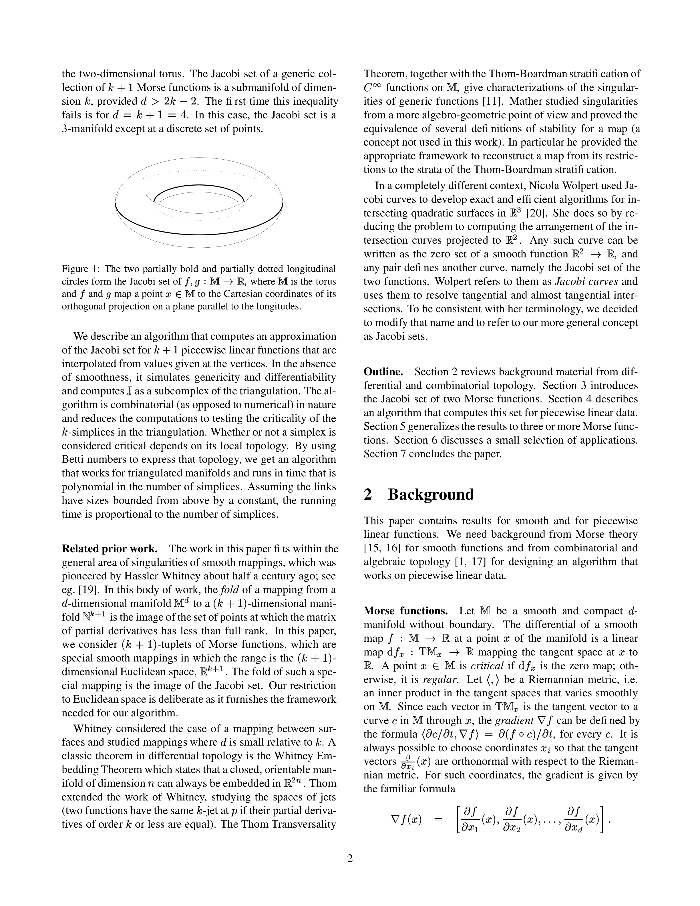
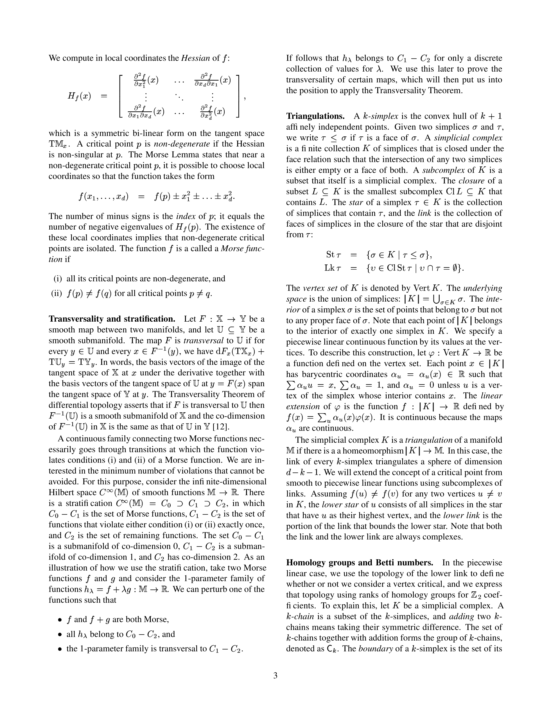
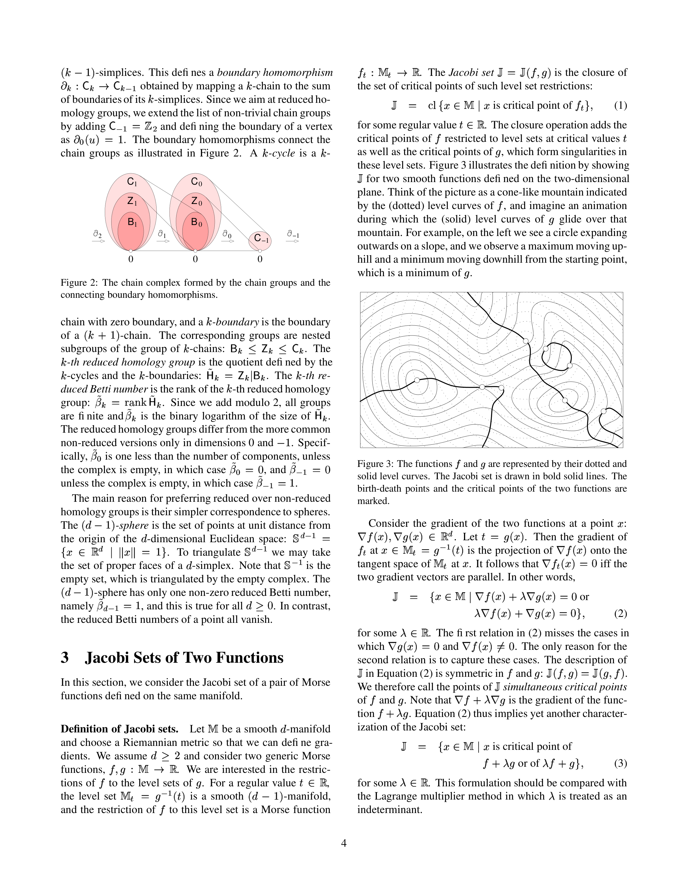
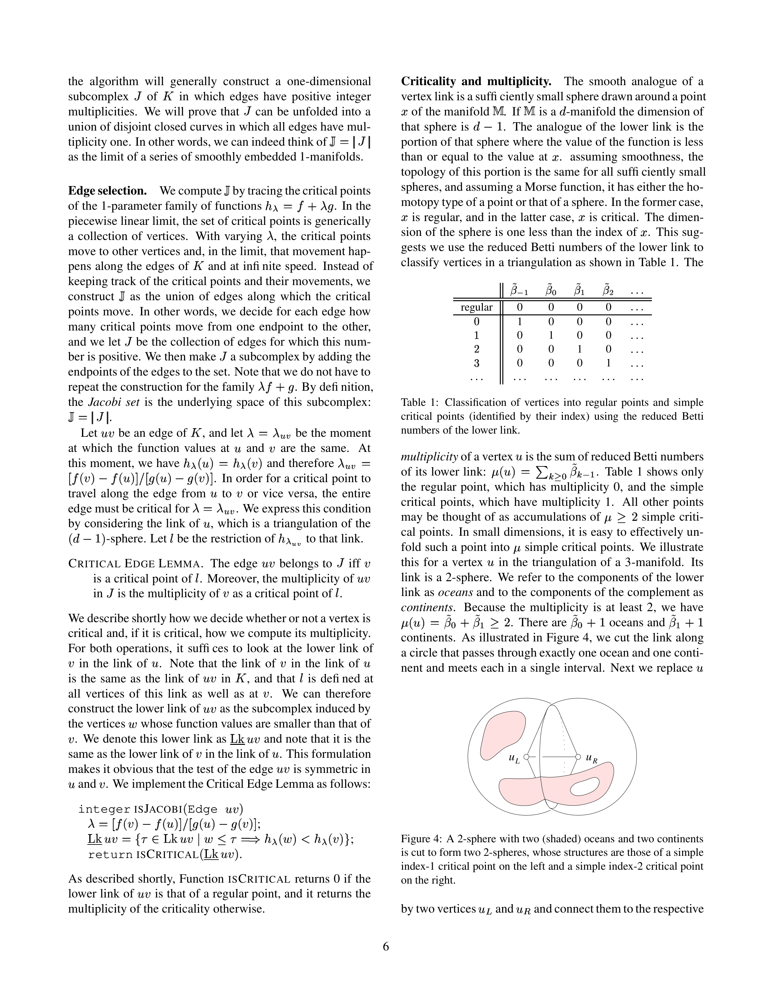

# Jacobi Sets of Multiple Morse Functions

**Herbert Edelsbrunner**${}^{1}$ **and John Harer**${}^{2}$

> ${}^{1}$ Department of Computer Science and Mathematics, Duke University, Durham, and Raindrop Geomagic, Research Triangle Park, North Carolina.
>
> ${}^{2}$ Department of Mathematics and Computer Science, Duke University, Durham, North Carolina.
>
> Research of the first author is partially supported by NSF under grants EIA-99-72879 and CCR-00-86013. Research of the second author is partially supported by NSF under grant DMS-01-07621.

---

> **Notation glossary** (for AI readability — key symbols used throughout the paper):
> - $\mathbb{M}$ — a smooth compact $d$-dimensional manifold without boundary
> - $\mathbb{J} = \mathbb{J}(f_1,\ldots,f_k)$ — the Jacobi set of $k$ Morse functions
> - $\nabla f(x)$ — gradient vector of $f$ at $x$ (column vector of first partial derivatives)
> - $H_f(x)$ — Hessian matrix of $f$ at $x$ ($d \times d$ symmetric matrix of second partial derivatives)
> - $T_x\mathbb{M}$ — tangent space to $\mathbb{M}$ at point $x$
> - $\tilde{\beta}_p$ — the $p$-th reduced Betti number (rank of $p$-th reduced homology group over $\mathbb{Z}_2$ coefficients)
> - $\tilde{\mathsf{H}}_p$ — the $p$-th reduced homology group
> - $\mathsf{C}_p, \mathsf{Z}_p, \mathsf{B}_p$ — groups of $p$-chains, $p$-cycles, $p$-boundaries respectively
> - $\text{Lk}\,\tau$ — link of simplex $\tau$ (faces of simplices in the closed star that are disjoint from $\tau$)
> - $\overline{\text{St}}\,\tau$ — closed star of simplex $\tau$
> - $\text{Lk}_{-}$ — lower link (subcomplex induced by vertices with strictly smaller function value)
> - $h_t = f + t \cdot g$ — the 1-parameter family of functions sweeping between $f$ and $g$
> - $\mu(v)$ — multiplicity of a critical point $v$ (sum of reduced Betti numbers of its lower link)
> - $K$ — a simplicial complex triangulating the manifold
> - $|K|$ — the underlying space (geometric union of all simplices in $K$)
> - $\mathbb{S}^{d-1}$ — the $(d-1)$-dimensional unit sphere in $\mathbb{R}^d$
> - $\mathbf{f} = (f_1,\ldots,f_k): \mathbb{M} \to \mathbb{R}^k$ — a $k$-tuplet of Morse functions regarded as a map to Euclidean space

---

## Abstract

**Mathematical meaning:** The Jacobi set captures all points where the gradients of two Morse functions become parallel — equivalently, where one function, restricted to a level set of the other, has a critical point. For generic pairs of functions, this set forms a smooth 1-dimensional curve (a 1-manifold). The paper presents a polynomial-time combinatorial algorithm computing a piecewise-linear analogue from vertex-valued data on a triangulation, and generalizes the construction to $k$ Morse functions ($k \leq d$) on a common $d$-manifold.

The Jacobi set of two Morse functions defined on a common $d$-manifold is the set of critical points of the restrictions of one function to the level sets of the other function. Equivalently, it is the set of points where the gradients of the functions are parallel. For a generic pair of Morse functions, the Jacobi set is a smoothly embedded 1-manifold. We give a polynomial-time algorithm that computes the piecewise linear analog of the Jacobi set for functions specified at the vertices of a triangulation, and we generalize all results to more than two but at most $d$ Morse functions.

**Keywords.** Differential and computational topology, Morse functions, critical points, level sets, Betti numbers, algorithms.

---

## 1 Introduction

This paper is a mathematical and algorithmic study of multiple Morse functions, and in particular of their Jacobi sets. As we will see, this set is related to the Lagrange multiplier method in multi-variable calculus of which our algorithm may be viewed as a discrete analog.

### Motivation

Natural phenomena are frequently modeled using continuous functions, and having two or more such functions defined on the same domain is a fairly common scenario in the sciences. Consider for example oceanography where researchers study the distribution of various attributes of water, with the goal to shed light on the ocean dynamics and gain insight into global climate changes [4]. One such attribute is temperature, another is salinity, an important indicator of water density. The temperature distribution is often studied within a layer of constant salinity, because water tends to mix along but not between these layers. Mathematically, we may think of temperature and salinity as two continuous functions on a common portion of three-dimensional space. A layer is determined by a level surface of the salinity function, and we are interested in the temperature function restricted to that surface. This is a continuous function on a two-dimensional domain, whose critical points are generically minima, saddles, and maxima. In this paper, we study the paths these critical points take when the salinity value varies. As it turns out, these paths are also the paths the critical points of the salinity function take if we restrict it to the level surfaces of the temperature function. More generally, we study the relationship between continuous functions defined on a common manifold by analyzing the critical points within level set restrictions.

Sometimes it is useful to make up auxiliary functions to study the properties of given ones. Consider for example a function that varies with time, such as the gravitational potential generated by the sun, planets, and moons in our solar system [18]. At the critical points of that potential, the gravitational forces are at an equilibrium. The planets and moons move relative to each other and the sun, which implies that the critical points move, appear, and disappear. To study such a time-varying function, we introduce another, whose value at any point in space-time is the time. The paths of the critical points of the gravitational potential are then the Jacobi set of the two functions defined on a common portion of space-time.

### Results

**Mathematical meaning:** The Jacobi set $\mathbb{J}(f_1,\ldots,f_k)$ of $k \leq d$ Morse functions on a $d$-manifold $\mathbb{M}$ is defined as the closure of the set of simultaneous critical points — points where the $k$ gradients become linearly dependent. For $k=2$ on a 2-manifold, $\mathbb{J}$ is generically a union of disjoint smooth closed curves. For general $k$, $\mathbb{J}$ is a $(k-1)$-dimensional submanifold as long as $d \geq 2k-1$.

The main object of study in this paper is the Jacobi set $\mathbb{J} = \mathbb{J}(f_1, f_2, \ldots, f_k)$ of $k \leq d$ Morse functions on a common $d$-manifold. By definition, this is the set of critical points of $f_k$ restricted to the intersection of the level sets of $f_1$ to $f_{k-1}$. We observe that $\mathbb{J}$ is symmetric in the $k$ functions because it is the set of points at which the $k$ gradient vectors are linearly dependent.

In the simplest non-trivial case, we have two Morse functions on a common 2-manifold. In this case, the Jacobi set $\mathbb{J} = \mathbb{J}(f, g)$ is generically a collection of pairwise disjoint smooth curves that are free of any self-intersections. Figure 1 illustrates the concept for two Morse functions on the two-dimensional torus. The Jacobi set of a generic collection of $k$ Morse functions is a submanifold of dimension $k-1$, provided $d \geq 2k-1$. The first time this inequality fails is for $d = 2(k-1)$. In this case, the Jacobi set is a 3-manifold except at a discrete set of points.



> **Figure 1:** The two partially bold and partially dotted longitudinal circles form the Jacobi set of $(f, g)$, where $\mathbb{M}$ is the torus and $f$ and $g$ map a point $x \in \mathbb{M}$ to the Cartesian coordinates of its orthogonal projection on a plane parallel to the longitudes.

We describe an algorithm that computes an approximation of the Jacobi set for $k$ piecewise linear functions that are interpolated from values given at the vertices. In the absence of smoothness, it simulates genericity and differentiability and computes $\mathbb{J}$ as a subcomplex of the triangulation. The algorithm is combinatorial (as opposed to numerical) in nature and reduces the computations to testing the criticality of the $k$-simplices in the triangulation. Whether or not a simplex is considered critical depends on its local topology. By using Betti numbers to express that topology, we get an algorithm that works for triangulated manifolds and runs in time that is polynomial in the number of simplices. Assuming the links have sizes bounded from above by a constant, the running time is proportional to the number of simplices.

### Related Prior Work

The work in this paper fits within the general area of singularities of smooth mappings, which was pioneered by Hassler Whitney about half a century ago; see e.g. [19]. In this body of work, the fold of a mapping from a $d$-dimensional manifold $\mathbb{M}$ to a $(k+1)$-dimensional manifold $\mathbb{N}$ is the image of the set of points at which the matrix of partial derivatives has less than full rank. In this paper, we consider $(k+1)$-tuplets of Morse functions, which are special smooth mappings in which the range is the $(k+1)$-dimensional Euclidean space, $\mathbb{R}^{k+1}$. The fold of such a special mapping is the image of the Jacobi set. Our restriction to Euclidean space is deliberate as it furnishes the framework needed for our algorithm.

Whitney considered the case of a mapping between surfaces and studied mappings where $d$ is small relative to $k$. A classic theorem in differential topology is the Whitney Embedding Theorem which states that a closed, orientable manifold of dimension $n$ can always be embedded in $\mathbb{R}^{2n}$. Thom extended the work of Whitney, studying the spaces of jets (two functions have the same $k$-jet at $x$ if their partial derivatives of order $k$ or less are equal). The Thom Transversality Theorem, together with the Thom-Boardman stratification of functions on $M$, give characterizations of the singularities of generic functions [11]. Mather studied singularities from a more algebro-geometric point of view and proved the equivalence of several definitions of stability for a map (a concept not used in this work). In particular he provided the appropriate framework to reconstruct a map from its restrictions to the strata of the Thom-Boardman stratification.

In a completely different context, Nicola Wolpert used Jacobi curves to develop exact and efficient algorithms for intersecting quadratic surfaces in $\mathbb{R}^3$ [20]. She does so by reducing the problem to computing the arrangement of the intersection curves projected to $\mathbb{R}^2$. Any such curve can be written as the zero set of a smooth function $\mathbb{R}^2 \to \mathbb{R}$, and any pair defines another curve, namely the Jacobi set of the two functions. Wolpert refers to them as Jacobi curves and uses them to resolve tangential and almost tangential intersections. To be consistent with her terminology, we decided to modify that name and to refer to our more general concept as Jacobi sets.

### Outline

Section 2 reviews background material from differential and combinatorial topology. Section 3 introduces the Jacobi set of two Morse functions. Section 4 describes an algorithm that computes this set for piecewise linear data. Section 5 generalizes the results to three or more Morse functions. Section 6 discusses a small selection of applications. Section 7 concludes the paper.

---

## 2 Background

This paper contains results for smooth and for piecewise linear functions. We need background from Morse theory [15, 16] for smooth functions and from combinatorial and algebraic topology [1, 17] for designing an algorithm that works on piecewise linear data.

### Morse Functions

Let $\mathbb{M}$ be a smooth and compact $d$-manifold without boundary. The differential of a smooth map $f: \mathbb{M} \to \mathbb{R}$ at a point $x$ of the manifold is a linear map $df_x: T_x\mathbb{M} \to \mathbb{R}$ mapping the tangent space at $x$ to $\mathbb{R}$. A point $x \in \mathbb{M}$ is critical if $df_x$ is the zero map; otherwise, it is regular. Let $\langle\cdot,\cdot\rangle$ be a Riemannian metric, i.e. an inner product in the tangent spaces that varies smoothly on $\mathbb{M}$. Since each vector in $T_x\mathbb{M}$ is the tangent vector to a curve $c$ in $\mathbb{M}$ through $x$, the gradient $\nabla f$ can be defined by the formula $\langle\nabla f(x), \dot{c}(0)\rangle = df_x(\dot{c}(0))$, for every $c$. It is always possible to choose coordinates $x_i$ so that the tangent vectors $\frac{\partial}{\partial x_i}$ are orthonormal with respect to the Riemannian metric. For such coordinates, the gradient is given by the familiar formula

**Mathematical meaning:** The gradient $\nabla f(x)$ is a column vector in $\mathbb{R}^d$ whose $i$-th entry is the first-order partial derivative of $f$ with respect to the coordinate $x_i$, evaluated at $x$. This is the direction and rate of steepest ascent of $f$.

$$\nabla f(x) = \left(\frac{\partial f}{\partial x_1}(x), \frac{\partial f}{\partial x_2}(x), \ldots, \frac{\partial f}{\partial x_d}(x)\right)^T.$$

where:
- $\frac{\partial f}{\partial x_i}(x)$ — the partial derivative of $f$ with respect to the $i$-th coordinate, evaluated at $x$
- The superscript $T$ denotes the transpose (making it a column vector)

We compute in local coordinates the Hessian of $f$:

**Mathematical meaning:** The Hessian $H_f(x)$ is a $d \times d$ symmetric matrix whose $(i,j)$ entry is the second-order mixed partial derivative $\frac{\partial^2 f}{\partial x_i \partial x_j}(x)$. It encodes the local quadratic curvature of $f$ near $x$ and defines a symmetric bilinear form on the tangent space.

$$H_f(x) = \begin{pmatrix}
\frac{\partial^2 f}{\partial x_1 \partial x_1}(x) & \cdots & \frac{\partial^2 f}{\partial x_1 \partial x_d}(x) \\
\vdots & \ddots & \vdots \\
\frac{\partial^2 f}{\partial x_d \partial x_1}(x) & \cdots & \frac{\partial^2 f}{\partial x_d \partial x_d}(x)
\end{pmatrix}$$

which is a symmetric bi-linear form on the tangent space $T_x\mathbb{M}$. A critical point $x$ is non-degenerate if the Hessian is non-singular at $x$. The Morse Lemma states that near a non-degenerate critical point $x$, it is possible to choose local coordinates so that the function takes the form

**Mathematical meaning:** Near a non-degenerate critical point, every Morse function can be written in local coordinates as a purely quadratic form: a constant $f(x)$ minus $\lambda$ squared terms (the "downward" directions) plus $(d-\lambda)$ squared terms (the "upward" directions). The integer $\lambda$ is the **Morse index** — the number of independent directions in which $f$ decreases from $x$.

$$f(x_1, \ldots, x_d) = f(x) - x_1^2 - \cdots - x_{\lambda}^2 + x_{\lambda+1}^2 + \cdots + x_d^2.$$

where:
- $\lambda$ — the Morse index (number of negative eigenvalues of the Hessian, i.e., number of downward directions)
- The $-x_i^2$ terms correspond to directions where $f$ decreases (negative eigenvalues)
- The $+x_j^2$ terms correspond to directions where $f$ increases (positive eigenvalues)

The number of minus signs is the index of $x$; it equals the number of negative eigenvalues of $H_f(x)$. The existence of these local coordinates implies that non-degenerate critical points are isolated. The function $f$ is called a Morse function if

* (i) all its critical points are non-degenerate, and
* (ii) $f(x) \neq f(y)$ for all critical points $x \neq y$.

### Transversality and Stratification

Let $F: \mathbb{M} \to \mathbb{N}$ be a smooth map between two manifolds, and let $U \subseteq \mathbb{N}$ be a smooth submanifold. The map $F$ is transversal to $U$ if for every $y \in U$ and every $x \in F^{-1}(y)$, we have $dF_x(T_x\mathbb{M}) + T_y U = T_y \mathbb{N}$. In words, the basis vectors of the image of the tangent space of $\mathbb{M}$ at $x$ under the derivative together with the basis vectors of the tangent space of $U$ at $y = F(x)$ span the tangent space of $\mathbb{N}$ at $y$. The Transversality Theorem of differential topology asserts that if $F$ is transversal to $U$ then $F^{-1}(U)$ is a smooth submanifold of $\mathbb{M}$ and the co-dimension of $F^{-1}(U)$ in $\mathbb{M}$ is the same as that of $U$ in $\mathbb{N}$ [12].

**Mathematical meaning (Transversality condition):** The transversality equation $dF_x(T_x\mathbb{M}) + T_y U = T_y \mathbb{N}$ means that the image of the derivative of $F$ together with the tangent space of the submanifold $U$ at $y = F(x)$ together span the entire tangent space of the target manifold $\mathbb{N}$ at $y$. Intuitively: the map $F$ meets the submanifold $U$ "at an angle" rather than tangentially.

A continuous family connecting two Morse functions necessarily goes through transitions at which the function violates conditions (i) and (ii) of a Morse function. We are interested in the minimum number of violations that cannot be avoided. For this purpose, consider the infinite-dimensional Hilbert space $C^{\infty}(\mathbb{M})$ of smooth functions $\mathbb{M} \to \mathbb{R}$. There is a stratification $C^{\infty}(\mathbb{M}) = C_0 \supseteq C_1 \supseteq C_2$, in which $C_0 - C_1$ is the set of Morse functions, $C_1 - C_2$ is the set of functions that violate either condition (i) or (ii) exactly once, and $C_2$ is the set of remaining functions. The set $C_0 - C_1$ is a submanifold of co-dimension 0, $C_1 - C_2$ is a submanifold of co-dimension 1, and $C_2$ has co-dimension 2. As an illustration of how we use the stratification, take two Morse functions $f$ and $g$ and consider the 1-parameter family of functions $h_t = f + t \cdot g$, $t \in \mathbb{R}$. We can perturb one of the functions such that

* $f$ and $f+g$ are both Morse,
* all $h_t$ belong to $C_0 - C_1$, and
* the 1-parameter family is transversal to $C_1 - C_2$.

It follows that $h_t$ belongs to $C_1 - C_2$ for only a discrete collection of values for $t$. We use this later to prove the transversality of certain maps, which will then put us into the position to apply the Transversality Theorem.

### Triangulations

A $k$-simplex is the convex hull of $k+1$ affinely independent points. Given two simplices $\sigma$ and $\tau$, we write $\tau \leq \sigma$ if $\tau$ is a face of $\sigma$. A simplicial complex $K$ is a finite collection of simplices that is closed under the face relation such that the intersection of any two simplices is either empty or a face of both. A subcomplex of $K$ is a subset that itself is a simplicial complex. The closure of a subset $L \subseteq K$ is the smallest subcomplex $\overline{L} \subseteq K$ that contains $L$. The star of a simplex $\tau \in K$ is the collection of simplices that contain $\tau$, and the link is the collection of faces of simplices in the closure of the star that are disjoint from $\tau$:

**Mathematical meaning:** The link $\text{Lk}\,\tau$ is the simplicial complex consisting of all simplices $\sigma$ that belong to the closed star of $\tau$ (faces of simplices containing $\tau$) but that share no vertices with $\tau$ itself. Geometrically, the link of a $k$-simplex in a triangulated $d$-manifold is a triangulated sphere of dimension $d-k-1$.

$$\text{Lk}\,\tau = \{\sigma \in \overline{\text{St}}\,\tau \mid \sigma \cap \tau = \emptyset\}.$$

where:
- $\overline{\text{St}}\,\tau$ — the closed star of $\tau$ (all simplices that contain $\tau$, and all their faces)
- $\sigma \cap \tau = \emptyset$ — the condition that $\sigma$ and $\tau$ share no vertices

The vertex set of $K$ is denoted by $\text{Vert}\,K$. The underlying space is the union of simplices: $|K| = \bigcup_{\sigma \in K} \sigma$. The interior of a simplex $\sigma$ is the set of points that belong to $\sigma$ but not to any proper face of $\sigma$. Note that each point of $|K|$ belongs to the interior of exactly one simplex in $K$. We specify a piecewise linear continuous function by its values at the vertices. To describe this construction, let $\varphi: \text{Vert}\,K \to \mathbb{R}$ be a function defined on the vertex set. Each point $x \in |K|$ has barycentric coordinates $b_u = b_u(x) \in \mathbb{R}$ such that $\sum_u b_u \cdot u = x$, $\sum_u b_u = 1$, and $b_u = 0$ unless $u$ is a vertex of the simplex whose interior contains $x$. The linear extension of $\varphi$ is the function $f: |K| \to \mathbb{R}$ defined by $f(x) = \sum_u b_u(x) \varphi(u)$. It is continuous because the maps $b_u$ are continuous.

The simplicial complex $K$ is a triangulation of a manifold $\mathbb{M}$ if there is a homeomorphism $|K| \to \mathbb{M}$. In this case, the link of every $k$-simplex triangulates a sphere of dimension $d-k-1$. We will extend the concept of a critical point from smooth to piecewise linear functions using subcomplexes of links. Assuming $f(u) \neq f(v)$ for any two vertices $u \neq v$ in $K$, the lower star of $u$ consists of all simplices in the star that have $u$ as their highest vertex, and the lower link is the portion of the link that bounds the lower star. Note that both the link and the lower link are always complexes.

### Homology Groups and Betti Numbers

In the piecewise linear case, we use the topology of the lower link to define whether or not we consider a vertex critical, and we express that topology using ranks of homology groups for $\mathbb{Z}_2$ coefficients. To explain this, let $K$ be a simplicial complex. A $p$-chain is a subset of the $p$-simplices, and adding two $p$-chains means taking their symmetric difference. The set of $p$-chains together with addition forms the group of $p$-chains, denoted as $\mathsf{C}_p$. The boundary of a $p$-simplex is the set of its $(p-1)$-simplices. This defines a boundary homomorphism $\partial_p: \mathsf{C}_p \to \mathsf{C}_{p-1}$ obtained by mapping a $p$-chain to the sum of boundaries of its $p$-simplices. Since we aim at reduced homology groups, we extend the list of non-trivial chain groups by adding $\mathsf{C}_{-1} \cong \mathbb{Z}_2$ and defining the boundary of a vertex as $\partial_0(u) = 1$. The boundary homomorphisms connect the chain groups as illustrated in Figure 2.



> **Figure 2:** The chain complex formed by the chain groups and the connecting boundary homomorphisms.

**Mathematical meaning:** A $p$-cycle is a $p$-chain whose boundary is zero (it forms a closed loop/surface/etc. in dimension $p$). A $p$-boundary is a $p$-chain that is itself the boundary of some $(p+1)$-chain. The $p$-th reduced homology group $\tilde{\mathsf{H}}_p = \mathsf{Z}_p / \mathsf{B}_p$ measures "$p$-dimensional holes" — cycles that are not boundaries. The $p$-th reduced Betti number $\tilde{\beta}_p = \text{rank}\,\tilde{\mathsf{H}}_p$ counts the number of independent $p$-dimensional holes.

A $p$-cycle is a $p$-chain with zero boundary, and a $p$-boundary is the boundary of a $(p+1)$-chain. The corresponding groups are nested subgroups of the group of $p$-chains: $\mathsf{B}_p \subseteq \mathsf{Z}_p \subseteq \mathsf{C}_p$. The $p$-th reduced homology group is the quotient defined by the $p$-cycles and the $p$-boundaries: $\tilde{\mathsf{H}}_p = \mathsf{Z}_p / \mathsf{B}_p$. The $p$-th reduced Betti number is the rank of the $p$-th reduced homology group: $\tilde{\beta}_p = \text{rank}\,\tilde{\mathsf{H}}_p$. Since we add modulo 2, all groups are finite and $\tilde{\beta}_p$ is the binary logarithm of the size of $\tilde{\mathsf{H}}_p$.

The reduced homology groups differ from the more common non-reduced versions only in dimensions 0 and $-1$. Specifically, $\tilde{\beta}_0$ is one less than the number of components, unless the complex is empty, in which case $\tilde{\beta}_0 = 0$, and $\tilde{\beta}_{-1} = 0$ unless the complex is empty, in which case $\tilde{\beta}_{-1} = 1$.

The main reason for preferring reduced over non-reduced homology groups is their simpler correspondence to spheres. The $(d-1)$-sphere is the set of points at unit distance from the origin of the $d$-dimensional Euclidean space: $\mathbb{S}^{d-1} = \{x \in \mathbb{R}^d \mid \|x\| = 1\}$. To triangulate $\mathbb{S}^{d-1}$ we may take the set of proper faces of a $d$-simplex. Note that $\mathbb{S}^{-1}$ is the empty set, which is triangulated by the empty complex. The $(d-1)$-sphere has only one non-zero reduced Betti number, namely $\tilde{\beta}_{d-1} = 1$, and this is true for all $d \geq 0$. In contrast, the reduced Betti numbers of a point all vanish.

---

## 3 Jacobi Sets of Two Functions

In this section, we consider the Jacobi set of a pair of Morse functions defined on the same manifold.

### Definition of Jacobi Sets

Let $\mathbb{M}$ be a smooth $d$-manifold and choose a Riemannian metric so that we can define gradients. We assume $d \geq 2$ and consider two generic Morse functions, $f, g: \mathbb{M} \to \mathbb{R}$. We are interested in the restrictions of $f$ to the level sets of $g$. For a regular value $t \in \mathbb{R}$, the level set $\mathbb{M}_t = g^{-1}(t)$ is a smooth $(d-1)$-manifold, and the restriction of $f$ to this level set is a Morse function $f_t: \mathbb{M}_t \to \mathbb{R}$. The Jacobi set $\mathbb{J} = \mathbb{J}(f, g)$ is the closure of the set of critical points of such level set restrictions:

**Mathematical meaning (Equation 1):** The Jacobi set $\mathbb{J}$ is defined as the topological closure of all points $x \in \mathbb{M}$ that are critical points of the restricted function $f_t$ (the function $f$ confined to the level set $g^{-1}(t)$), as the level value $t$ ranges over all regular values of $g$. Taking the closure ensures that critical points of $g$ and critical points of $f$ at critical level sets of $g$ are included.

$$\mathbb{J} = \text{cl}\,\{x \in \mathbb{M} \mid x \text{ is critical point of } f_t\} \tag{1}$$

for some regular value $t \in \mathbb{R}$. The closure operation adds the critical points of $f$ restricted to level sets at critical values $t$ as well as the critical points of $g$, which form singularities in these level sets. Figure 3 illustrates the definition by showing $\mathbb{J}$ for two smooth functions defined on the two-dimensional plane. Think of the picture as a cone-like mountain indicated by the (dotted) level curves of $f$, and imagine an animation during which the (solid) level curves of $g$ glide over that mountain. For example, on the left we see a circle expanding outwards on a slope, and we observe a maximum moving uphill and a minimum moving downhill from the starting point, which is a minimum of $g$.



> **Figure 3:** The functions $f$ and $g$ are represented by their dotted and solid level curves. The Jacobi set is drawn in bold solid lines. The birth-death points and the critical points of the two functions are marked.

Consider the gradient of the two functions at a point $x$: $\nabla f(x), \nabla g(x) \in \mathbb{R}^d$. Let $t = g(x)$. Then the gradient of $f_t$ at $x \in \mathbb{M}_t = g^{-1}(t)$ is the projection of $\nabla f(x)$ onto the tangent space of $\mathbb{M}_t$ at $x$. It follows that $\nabla f_t(x) = 0$ iff the two gradient vectors are parallel. In other words,

**Mathematical meaning (Equation 2):** A point $x$ belongs to the Jacobi set exactly when the gradients $\nabla f(x)$ and $\nabla g(x)$ are linearly dependent (parallel or anti-parallel). The two alternative equations cover the cases where $\nabla g(x) \neq 0$ (first equation, with $\lambda = -\|\nabla f\|/\|\nabla g\|$) and where $\nabla f(x) \neq 0$ but $\nabla g(x) = 0$ (second equation, captured with $\lambda = 0$). This makes the definition symmetric in $f$ and $g$.

$$\mathbb{J} = \{x \in \mathbb{M} \mid \nabla f(x) + \lambda \nabla g(x) = 0 \text{ or } \lambda \nabla f(x) + \nabla g(x) = 0\} \tag{2}$$

for some $\lambda \in \mathbb{R}$. The first relation in (2) misses the cases in which $\nabla g(x) = 0$ and $\nabla f(x) \neq 0$. The only reason for the second relation is to capture these cases. The description of $\mathbb{J}$ in Equation (2) is symmetric in $f$ and $g$: $\mathbb{J}(f, g) = \mathbb{J}(g, f)$. We therefore call the points of $\mathbb{J}$ *simultaneous critical points* of $f$ and $g$. Note that $\nabla f + \lambda \nabla g$ is the gradient of the function $f + \lambda g$. Equation (2) thus implies yet another characterization of the Jacobi set:

**Mathematical meaning (Equation 3):** The Jacobi set can be re-characterized as the set of points $x$ that are critical points of some linear combination $f + \lambda g$ (or $\lambda f + g$). This is the Lagrange multiplier formulation: $x \in \mathbb{J}$ iff there exists a scalar $\lambda$ such that $x$ is a critical point of the combined function $f + \lambda g$. The parameter $\lambda$ plays the role of the Lagrange multiplier.

$$\mathbb{J} = \{x \in \mathbb{M} \mid x \text{ is critical point of } f + \lambda g \text{ or of } \lambda f + g\} \tag{3}$$

for some $\lambda \in \mathbb{R}$. This formulation should be compared with the Lagrange multiplier method in which $\lambda$ is treated as an indeterminate.

### Critical Curves

Generically, $f_t$ has a discrete collection of critical points, and these points sweep out $\mathbb{J}$ as $t$ varies. It follows that $\mathbb{J}$ is a one-dimensional set. We strengthen this observation and prove that the Jacobi set is a smoothly embedded 1-manifold in $\mathbb{M}$. This follows from the stratification of the Jacobi set described in [11], which we will sketch in Section 5. For completeness, we give a direct proof that avoids the more advanced concepts needed to prove the more general result.

> **SMOOTH EMBEDDING THEOREM.** Generically, the Jacobi set of two Morse functions $f, g: \mathbb{M} \to \mathbb{R}$ is a smoothly embedded 1-manifold in $\mathbb{M}$.

*Proof.* Assume $\mathbb{M}$ is a $d$-manifold, for $d \geq 2$, and consider the functions $\Phi, \Psi: \mathbb{M} \times \mathbb{R} \to \mathbb{R}^d$ that map a point $x \in \mathbb{M}$ and a parameter $\lambda \in \mathbb{R}$ to the gradients of $f + \lambda g$ and $\lambda f + g$:

**Mathematical meaning:** $\Phi(x,\lambda) = \nabla f(x) + \lambda \nabla g(x)$ is the gradient of the combined function $f + \lambda g$ evaluated at $x$. The zero-set $\Phi^{-1}(0)$ captures all pairs $(x,\lambda)$ where $x$ is a critical point of $f + \lambda g$. Similarly, $\Psi^{-1}(0)$ captures critical points of $\lambda f + g$. The Jacobi set $\mathbb{J}$ is then the projection of these zero-sets back onto the manifold $\mathbb{M}$.

$$\Phi(x, \lambda) = \nabla f(x) + \lambda \nabla g(x), \quad \Psi(x, \lambda) = \lambda \nabla f(x) + \nabla g(x).$$

By Equation (2), a point $x$ belongs to $\mathbb{J}$ iff there is a $\lambda \in \mathbb{R}$ such that $\Phi(x, \lambda) = 0$ or $\Psi(x, \lambda) = 0$. Letting $\mathbb{X} = \Phi^{-1}(0)$ and $\mathbb{Y} = \Psi^{-1}(0)$, we get $\mathbb{J}$ by projecting onto $\mathbb{M}$:

**Mathematical meaning:** The projection $\pi: \mathbb{M} \times \mathbb{R} \to \mathbb{M}$ defined by $\pi(x,\lambda) = x$ maps the 1-dimensional solution sets $\mathbb{X}$ and $\mathbb{Y}$ to the Jacobi set in $\mathbb{M}$.

$$\mathbb{J} = \pi(\mathbb{X}) \cup \pi(\mathbb{Y}).$$

We have $\mathbb{J} = \mathbb{J}_X \cup \mathbb{J}_Y$, where $\mathbb{J}_X$ is $\mathbb{J}$ minus the discrete set of points where $\nabla g(x) = 0$, and $\mathbb{J}_Y$ is $\mathbb{J}$ minus the points where $\nabla f(x) = 0$. We prove that $\Phi$ is transversal to $0$ or, equivalently, that for every $(x, \lambda) \in \Phi^{-1}(0)$, the derivative of $\Phi$ at $(x, \lambda)$ has rank $d$. We compute

**Mathematical meaning:** The derivative $d\Phi_{(x,\lambda)}$ is a $d \times (d+1)$ matrix formed by horizontally concatenating the $d \times d$ Hessian matrix $H_{f+\lambda g}(x)$ (derivatives with respect to the spatial coordinates $x$) and the $d \times 1$ column vector $\nabla g(x)$ (derivative with respect to the parameter $\lambda$). For transversality to $0 \in \mathbb{R}^d$, this matrix must have full row rank $d$.

$$d\Phi_{(x,\lambda)} = \begin{pmatrix} H_{f+\lambda g}(x) & | & \nabla g(x) \end{pmatrix},$$

where the Hessian is a $d$-by-$d$ matrix.

As mentioned in Section 2, we can assume that all functions $h_t = f + t \cdot g$ are in $C_0 - C_1$, except for a discrete number, which are in $C_1 - C_2$. The former have only non-degenerate critical points, so the Hessian itself already has rank $d$. Let $t_0$ be a value for which $h_{t_0}$ is not Morse. If there are two critical points sharing the same function value, then the Hessian is still invertible and there is nothing else to show. Otherwise, there is a single birth-death point $x_0$, and we write $c_0 = h_{t_0}(x_0)$. There exist local coordinates such that $x_0 = (0, 0, \ldots, 0)$, $t_0 = 0$, and

**Mathematical meaning:** At a birth-death point (fold singularity), the function $h_{t_0}$ takes the local normal form of a cubic in the first coordinate $x_1$ (the degenerate direction where two critical points merge) plus a non-degenerate quadratic form in the remaining $d-1$ coordinates. Setting $t_0 = 0$ places the bifurcation exactly at the origin. The term $-t_0 x_1 = 0$ vanishes, leaving the purely cubic $x_1^3$ behavior.

$$h_{t_0}(x) = c_0 + x_1^3 - t_0 x_1 \pm x_2^2 \pm \cdots \pm x_d^2$$

in a neighborhood of $(x_0, t_0)$. Note that this implies $g(x) = -x_1$. We can write the Hessian and the gradient explicitly and get

**Mathematical meaning:** At the birth-death point $(x_0, \lambda_0)$, the derivative matrix $d\Phi$ takes a nearly diagonal form: the first row is zero except for the last column entry $-1$ (which is $\nabla g(x_0) = \frac{\partial}{\partial x_1}(-x_1) = -1$), reflecting the cubic degeneracy in the $x_1$ direction. The remaining $d-1$ rows have diagonal entries $\pm 2$ from the quadratic terms, giving these rows full rank. Together, the matrix has rank $d$.

$$d\Phi_{(x_0,\lambda_0)} = \begin{pmatrix}
0 & 0 & \cdots & 0 & -1 \\
0 & \pm 2 & \cdots & 0 & 0 \\
\vdots & \vdots & \ddots & \vdots & \vdots \\
0 & 0 & \cdots & \pm 2 & 0
\end{pmatrix}.$$

This matrix has rank $d$. Since $0 \in \mathbb{R}^d$ has co-dimension $d$, the Transversality Theorem now implies that $\mathbb{X} = \Phi^{-1}(0)$ is a smooth 1-manifold in $\mathbb{M} \times \mathbb{R}$. We still need to prove that the projection of this 1-manifold is smoothly embedded in $\mathbb{M}$. Let $\pi: \mathbb{X} \to \mathbb{J}$ be defined by $\pi(x, \lambda) = x$. We show that $\pi$ is one-to-one and $d\pi_{(x,\lambda)} \neq 0$ for all $(x, \lambda) \in \mathbb{X}$. If $\pi(x, \lambda) = \pi(x', \lambda')$ then $x = x'$ and $\nabla f(x) + \lambda \nabla g(x) = \nabla f(x) + \lambda' \nabla g(x) = 0$. Since $\nabla g(x) \neq 0$ on $\mathbb{X}$, $\lambda = \lambda'$ so the projection is injective. To prove that the derivative $d\pi$ of $\pi$ is non-zero, note that the tangent line to $\mathbb{X}$ at $(x, \lambda)$ is the kernel of $d\Phi_{(x,\lambda)} = (H_{f+\lambda g}(x) \mid \nabla g(x))$. If $d\pi$ is zero at $(x, \lambda)$, then this tangent line must be vertical, spanned by the vector $p = (0, \ldots, 0, 1)^T$. But since $\nabla g(x) \neq 0$, $p$ cannot be in the kernel of $d\Phi_{(x,\lambda)}$.

By symmetry, everything we proved for $\Phi$ also holds for $\Psi$. This concludes our proof that generically, $\mathbb{J}$ is a smoothly embedded 1-manifold in $\mathbb{M}$. $\square$

---

## 4 Algorithm

In this section, we describe an algorithm that computes an approximation of the Jacobi set of two Morse functions from approximations of these functions. We begin by laying out our general philosophy and follow up by describing the details of the algorithm.

### General Approach

In applications, we never have smooth functions but usually non-smooth functions that approximate smooth functions. We choose not to think of the non-smooth functions as approximations of smooth functions. Quite the opposite, we think of the non-smooth functions as being approximated by smooth functions. The relatively simple smooth case then becomes the guiding intuition in designing the algorithm that constructs what one may call the Jacobi set of the non-smooth functions. To be more specific, let $K$ be a triangulation of a $d$-manifold $\mathbb{M}$ and let $\varphi, \psi: \text{Vert}\,K \to \mathbb{R}$ be two functions defined at the vertices. We obtain $f, g: |K| \to \mathbb{R}$ as piecewise linear extensions of $\varphi$ and $\psi$. We imagine that both piecewise linear functions are limits of series of smooth functions: $\lim_{n \to \infty} f_n = f$ and $\lim_{n \to \infty} g_n = g$. For each $n$, the Jacobi set $\mathbb{J}_n = \mathbb{J}(f_n, g_n)$ is perfectly well defined, and we aim at constructing the Jacobi set of $f$ and $g$ as the limit of the $\mathbb{J}_n$. Along the way, we will take some liberties in resolving the ambiguities in what this means exactly. As a guiding principle, we resolve ambiguities in a way consistent with the corresponding smooth concepts that arise in the imagined smooth approximations of $f$ and $g$. We call this principle the *simulation of differentiability* and combine it with the *simulation of simplicity* [9] to put ourselves within the realm of generic smooth functions.

After constructing the Jacobi set of $f$ and $g$, we may need to resolve the result into something whose structure is consistent with that of its smooth counterpart. Most importantly, the algorithm will generally construct a one-dimensional subcomplex $\mathbb{J}$ of $K$ in which edges have positive integer multiplicities. We will prove that $\mathbb{J}$ can be unfolded into a union of disjoint closed curves in which all edges have multiplicity one. In other words, we can indeed think of $\mathbb{J} = |\mathbb{J}|$ as the limit of a series of smoothly embedded 1-manifolds.

### Edge Selection

We compute $\mathbb{J}$ by tracing the critical points of the 1-parameter family of functions $h_t = f + t \cdot g$. In the piecewise linear limit, the set of critical points is generically a collection of vertices. With varying $t$, the critical points move to other vertices and, in the limit, that movement happens along the edges of $K$ and at infinite speed. Instead of keeping track of the critical points and their movements, we construct $\mathbb{J}$ as the union of edges along which the critical points move. In other words, we decide for each edge how many critical points move from one endpoint to the other, and we let $\mathbb{J}$ be the collection of edges for which this number is positive. We then make $\mathbb{J}$ a subcomplex by adding the endpoints of the edges to the set. Note that we do not have to repeat the construction for the family $t f + g$. By definition, the Jacobi set is the underlying space of this subcomplex: $\mathbb{J} = |\mathbb{J}|$.

Let $uv$ be an edge of $K$, and let $t = t_{uv}$ be the moment at which the function values at $u$ and $v$ are the same. At this moment, we have $h_t(u) = h_t(v)$ and therefore $t_{uv} = (f(v) - f(u)) / (g(u) - g(v))$. In order for a critical point to travel along the edge from $u$ to $v$ or vice versa, the entire edge must be critical for $t = t_{uv}$. We express this condition by considering the link of $u$, which is a triangulation of the $(d-1)$-sphere. Let $\tilde{h}$ be the restriction of $h_{t_{uv}}$ to that link.

> **CRITICAL EDGE LEMMA.** The edge $uv$ belongs to $\mathbb{J}$ iff $v$ is a critical point of $\tilde{h}$. Moreover, the multiplicity of $uv$ in $\mathbb{J}$ is the multiplicity of $v$ as a critical point of $\tilde{h}$.

We describe shortly how we decide whether or not a vertex is critical and, if it is critical, how we compute its multiplicity. For both operations, it suffices to look at the lower link of $v$ in the link of $u$. Note that the link of $v$ in the link of $u$ is the same as the link of $uv$ in $K$, and that $\tilde{h}$ is defined at all vertices of this link as well as at $v$. We can therefore construct the lower link of $uv$ as the subcomplex induced by the vertices $\zeta$ whose function values are smaller than that of $v$. We denote this lower link as $\text{Lk}_{-} uv$ and note that it is the same as the lower link of $v$ in the link of $u$. This formulation makes it obvious that the test of the edge $uv$ is symmetric in $u$ and $v$. We implement the Critical Edge Lemma as follows:

**Algorithmic intent:** Determine whether an edge $uv$ belongs to the Jacobi set by computing the parameter value $t_{uv}$ at which the two endpoint function values equalize under $h_t = f + t \cdot g$, then checking whether the lower link of $uv$ (with respect to $h_{t_{uv}}$) has the topology of a critical point. Returns the multiplicity (0 if not in $\mathbb{J}$, positive integer if in $\mathbb{J}$).

```
integer ISJACOBI (Edge uv)
  t = (f(v) - f(u)) / (g(u) - g(v));
  Lk_{-} uv = {σ ∈ Lk uv | h_t(ζ) < h_t(v) for all vertices ζ of σ};
  return ISCRITICAL(Lk_{-} uv).
```

where:
- `t` — the parameter $t_{uv}$ solving $h_t(u) = h_t(v)$, i.e., $f(u) + t \cdot g(u) = f(v) + t \cdot g(v)$
- `Lk_{-} uv` — the lower link of edge $uv$, i.e., all simplices in the link of $uv$ whose vertices all have strictly smaller $h_t$ value than the common value $h_t(u) = h_t(v)$
- `ISCRITICAL` — the criticality test function (see below), returning the multiplicity (sum of reduced Betti numbers of the lower link)

As described shortly, Function ISCRITICAL returns 0 if the lower link of $uv$ is that of a regular point, and it returns the multiplicity of the criticality otherwise.

### Criticality and Multiplicity

The smooth analogue of a vertex link is a sufficiently small sphere drawn around a point $x$ of the manifold $\mathbb{M}$. If $\mathbb{M}$ is a $d$-manifold the dimension of that sphere is $d-1$. The analogue of the lower link is the portion of that sphere where the value of the function is less than or equal to the value at $x$. Assuming smoothness, the topology of this portion is the same for all sufficiently small spheres, and assuming a Morse function, it has either the homotopy type of a point or that of a sphere. In the former case, $x$ is regular, and in the latter case, $x$ is critical. The dimension of the sphere is one less than the index of $x$. This suggests we use the reduced Betti numbers of the lower link to classify vertices in a triangulation as shown in Table 1.

**Table interpretation:** This table classifies vertices based on the reduced Betti numbers of their lower links. Each row corresponds to a vertex type (regular, or critical with a given Morse index). Each column $\tilde{\beta}_p$ is the $p$-th reduced Betti number. A vertex is regular iff its lower link has the homology of a point (all $\tilde{\beta}_p = 0$ for $p \geq 0$, and $\tilde{\beta}_{-1} = 1$). A vertex is a simple critical point of index $\lambda$ iff its lower link has the homology of a $(\lambda-1)$-sphere (exactly one $\tilde{\beta}_{\lambda-1} = 1$, all others zero). For example, a minimum (index 0) has $\tilde{\beta}_0 = 1$ (a 0-sphere, i.e., two disconnected points); a 1-saddle has $\tilde{\beta}_1 = 1$; a maximum in a 3-manifold (index 3) has $\tilde{\beta}_2 = 1$.

|                     | $\tilde{\beta}_0$ | $\tilde{\beta}_1$ | $\tilde{\beta}_2$ | $\tilde{\beta}_3$ | $\tilde{\beta}_{-1}$ |
|---------------------|-------------------|-------------------|-------------------|-------------------|-----------------------|
| regular             | 0                 | 0                 | 0                 | 0                 | 1                     |
| index 0 (minimum)   | 1                 | 0                 | 0                 | 0                 | 0                     |
| index 1 (1-saddle)  | 0                 | 1                 | 0                 | 0                 | 0                     |
| index 2 (2-saddle)  | 0                 | 0                 | 1                 | 0                 | 0                     |
| index 3 (maximum)   | 0                 | 0                 | 0                 | 1                 | 0                     |
| ...                 | ...               | ...               | ...               | ...               | ...                   |

> **Table 1:** Classification of vertices into regular points and simple critical points (identified by their index) using the reduced Betti numbers of the lower link.

The multiplicity of a vertex $v$ is the sum of reduced Betti numbers of its lower link: $\mu(v) = \sum_{p} \tilde{\beta}_p$. Table 1 shows only the regular point, which has multiplicity 0, and the simple critical points, which have multiplicity 1. All other points may be thought of as accumulations of $\mu \geq 2$ simple critical points. In small dimensions, it is easy to effectively unfold such a point into $\mu$ simple critical points. We illustrate this for a vertex $v$ in the triangulation of a 3-manifold. Its link is a 2-sphere. We refer to the components of the lower link as *oceans* and to the components of the complement as *continents*. Because the multiplicity is at least 2, we have $\mu(v) = \tilde{\beta}_0 + \tilde{\beta}_1 \geq 2$. There are $\tilde{\beta}_0 + 1$ oceans and $\tilde{\beta}_1 + 1$ continents. As illustrated in Figure 4, we cut the link along a circle that passes through exactly one ocean and one continent and meets each in a single interval. Next we replace $v$ by two vertices $v_L$ and $v_R$ and connect them to the respective side of the link and to each other.



> **Figure 4:** A 2-sphere with two (shaded) oceans and two continents is cut to form two 2-spheres, whose structures are those of a simple index-1 critical point on the left and a simple index-2 critical point on the right.

We have $\tilde{\beta}_0^L + \tilde{\beta}_0^R = \tilde{\beta}_0$ and $\tilde{\beta}_1^L + \tilde{\beta}_1^R = \tilde{\beta}_1$. To guarantee progress, we cut such that $\tilde{\beta}_0^L + \tilde{\beta}_1^L$ and $\tilde{\beta}_0^R + \tilde{\beta}_1^R$ are both less than $\mu$. This implies that both are at least one, which is equivalent to avoiding the creation of regular points and of minima and maxima. We repeat the process until all vertices are simple critical points. This happens after $\tilde{\beta}_0 + \tilde{\beta}_1 - 1$ splits, which generate $\tilde{\beta}_0$ simple critical points of index 1 and $\tilde{\beta}_1$ simple critical points of index 2. In summary, we compute the multiplicity of a vertex by summing the reduced Betti numbers of its lower link:

**Algorithmic intent:** Given a simplicial complex $L$ (the lower link of a vertex or simplex), compute its reduced Betti numbers $\tilde{\beta}_p$ for all dimensions $p \geq 0$. Return their sum, which is the multiplicity $\mu$ — zero means regular, one means simple critical, two or more means multiple critical points have coalesced.

```
integer ISCRITICAL (Complex L)
  foreach p ≥ 0 do compute β̃_p of L endfor;
  return Σ_{p≥0} β̃_p.
```

where:
- `β̃_p` — the $p$-th reduced Betti number $\tilde{\beta}_p$ of the complex $L$ (computed over $\mathbb{Z}_2$ coefficients)
- The sum $\sum_{p \geq 0} \tilde{\beta}_p$ is the total multiplicity $\mu$ of the critical point

To compute the reduced Betti numbers, we may use the Smith normal form algorithm described in [17]. For coefficients modulo 2, this amounts to doing Gaussian elimination on the incidence matrices, which takes a time cubic in the number of simplices in $L$. Even for integer coefficients, the worst-case running time is polynomial in the number of simplices [13]. For manifolds of dimension $d \leq 3$, we get the lower links as subcomplexes of spheres of dimension $d - 2 \leq 1$. For these we can use the significantly faster incremental algorithm of [7], whose running time is ever so slightly larger than proportional to the number of simplices in the link.

### Post-processing

The second step amounts to unfolding the union of edges to a 1-manifold. Define the degree of a vertex $v$ as the number of edges in $\mathbb{J}$ that share $v$, where we count each edge with its multiplicity. We use the fact that every vertex has even degree. This is suggested by our analysis of $\mathbb{J}$ in the smooth case but needs a direct proof, which is given below using an elementary parity argument. For good piecewise linear approximations of smooth functions, most vertices will have degree zero. If $v$ has degree 2 or higher, we glue the incident selected edges in pairs. For $d = 2$, this is done so that glued pairs do not cross at $v$.

> **EVEN DEGREE LEMMA.** The degree of every vertex in $\mathbb{J}$ is even.

*Proof.* We consider a vertex $v$ and the family of functions $h_t = f + t \cdot g$. For $t = -\infty$, $\mu(v)$ is independent of $f$ and the same at both extremes. We increase $t$ continuously from $-\infty$ to $+\infty$. Each time we pass a value $t = t_{uv}$, the status of the neighbor $u$ changes from inside to outside the lower link of $v$, or vice versa. The effect of this change on the type of $v$ depends on the type of $u$ in the restriction of $h_t$ to $\text{Lk } v$. Specifically, the multiplicity of $v$ either increases or decreases by the multiplicity of $u$ in the lower link of $v$. For example, if $u$ is regular then the change has no effect, and if $u$ is a simple critical point then it either increases or decreases $\mu(v)$ by one. The number of operations, each counted with multiplicity of $u$, is equal to the degree of $v$. Since we start and end with the same multiplicity of $v$, we add and subtract equally often, which implies that the degree is even. $\square$

---

## 5 Jacobi Sets of $k$ Functions

We generalize the results of Sections 3 and 4 from two to three or more functions defined on the same manifold.

### Smooth Case

Let $\mathbb{M}$ be a smooth $d$-manifold and choose a Riemannian metric. Consider $k \leq d$ Morse functions $f_1, f_2, \ldots, f_k$ on $\mathbb{M}$, and write $\mathbf{f} = (f_1, f_2, \ldots, f_k): \mathbb{M} \to \mathbb{R}^k$. The generic intersection of the level sets of $f_1$ to $f_{k-1}$ is a $(d - k + 1)$-dimensional smooth manifold. Let $\mathbf{t} = (t_1, \ldots, \hat{t_i}, \ldots, t_k)$ be a $(k-1)$-vector of image values, where the hat indicates that $t_i$ is not in the vector. Generically, the intersection of the corresponding level sets is a smooth $(d - k + 1)$-manifold:

**Mathematical meaning:** $\mathbb{M}_{\mathbf{t}}$ is the common intersection of $k-1$ level sets (all functions except $f_i$). Each level set $f_j^{-1}(t_j)$ is a hypersurface of co-dimension 1. Their transverse intersection has co-dimension $k-1$, so its dimension is $d - (k-1) = d - k + 1$.

$$\mathbb{M}_{\mathbf{t}} = \bigcap_{\substack{j=1 \\ j \neq i}}^k f_j^{-1}(t_j),$$

where:
- $\mathbf{t} = (t_1,\ldots,\hat{t_i},\ldots,t_k)$ — a vector of $k-1$ regular values (the hat $\hat{}$ means $t_i$ is omitted)
- $f_j^{-1}(t_j)$ — the level set $\{x \in \mathbb{M} \mid f_j(x) = t_j\}$

and the restriction $f_i|_{\mathbf{t}}$ of $f_i$ to $\mathbb{M}_{\mathbf{t}}$ is a Morse function. We call a critical point of this restriction a *simultaneous critical point* of $\mathbf{f}$. The Jacobi set $\mathbb{J} = \mathbb{J}(\mathbf{f})$ is the closure of the set of simultaneous critical points:

**Mathematical meaning (Equation 4):** The Jacobi set $\mathbb{J}$ of $k$ functions is the closure of all points $x$ that are critical points of $f_i$ when restricted to the common intersection of the level sets of the other $k-1$ functions, taken over all choices of the distinguished function $i$ and all regular value vectors $\mathbf{t}$.

$$\mathbb{J} = \text{cl}\,\{x \in \mathbb{M} \mid x \text{ is critical point of } f_i|_{\mathbf{t}}\} \tag{4}$$

for some index $i$ and some $(k-1)$-vector $\mathbf{t}$. Generically, the $k$ gradients $\nabla f_i$ at a point $x \in \mathbb{M}_{\mathbf{t}}$ span the $k$-dimensional linear subspace of vectors normal to $\mathbb{M}_{\mathbf{t}}$ at $x$, and $x$ is a critical point of $f_i|_{\mathbf{t}}$ iff $\nabla f_i(x)$ belongs to this linear subspace. This means that a direct definition of the Jacobi set is:

**Mathematical meaning (Equation 5):** $\mathbb{J}$ is the set of points $x$ where the $d \times k$ Jacobian matrix $J_{\mathbf{f}}(x)$ (whose $k$ columns are the gradient vectors of the $k$ functions) has rank strictly less than $k$ — meaning the $k$ gradients are linearly dependent. This is a clean, symmetric characterization that makes the independence from function ordering manifest.

$$\mathbb{J} = \{x \in \mathbb{M} \mid \text{rank } J_{\mathbf{f}}(x) < k\} \tag{5}$$

where $J_{\mathbf{f}}(x)$ is the $d$-by-$k$ matrix whose columns are the gradients of $f_1$ to $f_k$ at $x$. Equation (5) is symmetric in the components of $\mathbf{f}$, which implies that $\mathbb{J}$ is independent of the ordering of the $f_i$. The linear dependence of the $k$ gradient vectors implies that for each $x \in \mathbb{J}$ there is a gradient that can be written as a linear combination of the others:

**Mathematical meaning:** At any point $x \in \mathbb{J}$, one gradient $\nabla f_i(x)$ can be expressed as a linear combination $-\sum_{j \neq i} \lambda_j \nabla f_j(x)$ of the remaining $k-1$ gradients, where $\lambda_j \in \mathbb{R}$ are scalar coefficients (Lagrange multipliers).

$$\nabla f_i(x) + \sum_{j \neq i} \lambda_j \nabla f_j(x) = 0.$$

where:
- $\lambda_j$ — real scalar coefficients (Lagrange multipliers for the constraints $f_j = \text{const}$)

Since the combination of gradients is the gradient of the corresponding combination of functions, this implies

**Mathematical meaning (Equation 6):** Equivalently, $x \in \mathbb{J}$ iff $x$ is a critical point of some linear combination $f_i + \sum_{j \neq i} \lambda_j f_j$, mirroring the $k=2$ case (Equation 3). The Jacobi set is swept out by the critical points of a $(k-1)$-parameter family of such linear combinations.

$$\mathbb{J} = \{x \in \mathbb{M} \mid x \text{ is crit. pt. of } f_i + \sum_{j \neq i} \lambda_j f_j\} \tag{6}$$

for some index $i$ and some parameters $\lambda_j$. Generically, $\mathbb{J}$ is swept out by a $(k-1)$-parameter family of discrete points. It follows that $\mathbb{J}$ is a set of dimension $k-1$. Unfortunately, $\mathbb{J}$ is not always a submanifold of $\mathbb{M}$. Following [11], we define

**Mathematical meaning:** $\Sigma_r$ is the Boardman stratum consisting of points where the Jacobian matrix $J_{\mathbf{f}}(x)$ has rank exactly $k-r$ (i.e., the rank deficiency is $r$). The Jacobi set $\mathbb{J}$ is the disjoint union $\Sigma_1 \sqcup \Sigma_2 \sqcup \cdots$, where $\Sigma_1$ is the "generic" part (rank deficiency exactly 1) and higher $\Sigma_r$ are progressively more degenerate singularities. The set $\mathbb{J}$ is a manifold precisely when all higher strata $\Sigma_r$ ($r \geq 2$) are empty — there are no degeneracies beyond the generic rank-$(k-1)$ case.

$$\Sigma_r = \{x \in \mathbb{M} \mid \text{rank } J_{\mathbf{f}}(x) = k - r\}.$$

where:
- $\Sigma_r$ — the set of points where the Jacobian has rank $k-r$, i.e., the $k$ gradients span a $(k-r)$-dimensional subspace
- $r$ — the rank deficiency (co-rank); $r = 1$ is the generic Jacobi set, $r \geq 2$ are higher degeneracies

Clearly, $\mathbb{J}$ is the disjoint union of the $\Sigma_r$ for $r \geq 1$. The Transversality Theorem explained in Section 2 and the Thom Transversality Theorem [11, page 54] imply that $\Sigma_r$ is a submanifold of $\mathbb{M}$ of co-dimension $r \cdot (d - k + r)$ for each $r$, not necessarily a closed submanifold, however. Furthermore the closure of each $\Sigma_r$ is the union $\Sigma_r \cup \Sigma_{r+1} \cup \cdots$, however it is not necessarily a manifold. In particular, $\mathbb{J} = \text{cl } \Sigma_1$ is a manifold whenever $\Sigma_r$ (and therefore every $\Sigma_r$ for $r \geq 2$) is empty. This happens as long as $\Sigma_r$ has negative dimension, i.e., when its co-dimension exceeds the manifold dimension: $d < r \cdot (d - k + r)$. For $r = 2$, this inequality becomes $d < 2(d - k + 2)$, which simplifies to $2k < d + 4$, or equivalently $d \geq 2k - 3$ (since $d$ is an integer). The first time this condition fails — meaning $\Sigma_2$ first becomes non-empty and $\mathbb{J}$ ceases to be a manifold — occurs when $d = 2k - 4$. For $k = 3$ functions, this gives $d = 2$, i.e., a map from a 2-manifold to $\mathbb{R}^3$.

[**Correction note:** The original paper claimed equivalence to $d \geq 2k - 1$ and stated the first failure at a 3-manifold to $\mathbb{R}^2$. The correct derivation gives $d \geq 2k - 3$ with first failure at a 2-manifold to $\mathbb{R}^3$ ($d=2, k=3$). The co-dimension of $\Sigma_r$ is $r(d - k + r)$; for $\Sigma_2$ to be empty we need co-dim $> d$, giving $2(d - k + 2) > d \implies d > 2k - 4 \implies d \geq 2k - 3$.]

### Algorithm

Let $K$ be a triangulation of the $d$-manifold $\mathbb{M}$ and let $\varphi_i: \text{Vert}\,K \to \mathbb{R}$ be a function defined at the vertices, for $1 \leq i \leq k$. We obtain $f_i: |K| \to \mathbb{R}$ as the piecewise linear extension of $\varphi_i$, for each $i$. As in the case of $k = 2$ functions, we think of the $f_i$ as limits of smooth functions and construct a $(k-1)$-dimensional subcomplex $\mathbb{J} \subseteq K$ as the limit of the Jacobi sets of these smooth functions. Specifically, we compute the multiplicity of every $(k-1)$-simplex in $K$ and define $\mathbb{J}$ as the collection of $(k-1)$-simplices with positive multiplicity plus the collection of faces of these $(k-1)$-simplices. By definition, the Jacobi set is the underlying space of this subcomplex: $\mathbb{J} = |\mathbb{J}|$.

As suggested by Equation (6), we introduce a $(k-1)$-parameter family of functions

**Mathematical meaning:** $h_{\boldsymbol{\lambda}}$ is the linear combination of all $k$ functions with coefficients $(1, \lambda_1, \ldots, \widehat{\lambda_i}, \ldots, \lambda_k)$ — the distinguished function $f_i$ has coefficient 1, and the remaining $k-1$ functions have coefficients $\lambda_j$. This generalizes $h_t = f + tg$ from the $k=2$ case. The parameter vector $\boldsymbol{\lambda}$ lives in $\mathbb{R}^{k-1}$.

$$h_{\boldsymbol{\lambda}} = f_i + \sum_{j \neq i} \lambda_j f_j,$$

where $\boldsymbol{\lambda} = (\lambda_1, \ldots, \widehat{\lambda_i}, \ldots, \lambda_k)$. Next, we consider a $(k-1)$-simplex $\sigma$ with vertices $v_0, v_1, \ldots, v_{k-1}$ in $K$ and let $\boldsymbol{\lambda}_{\sigma}$ be the $(k-1)$-vector such that $h_{\boldsymbol{\lambda}_{\sigma}}(v_0) = h_{\boldsymbol{\lambda}_{\sigma}}(v_1) = \cdots = h_{\boldsymbol{\lambda}_{\sigma}}(v_{k-1})$. The link of $\sigma$ is a triangulated $(d - k)$-sphere, and as before we construct the lower link as the subcomplex induced by the vertices $\zeta$ with function values smaller than those of the vertices of $\sigma$. Whether or not $\sigma$ belongs to $\mathbb{J}$ depends on the topology or, more precisely, the reduced Betti numbers of the lower link:

**Algorithmic intent:** For a $(k-1)$-simplex $\sigma$, compute the unique parameter vector $\boldsymbol{\lambda}_{\sigma}$ that makes $h_{\boldsymbol{\lambda}}$ evaluate to the same value at all $k$ vertices of $\sigma$. Then compute the lower link of $\sigma$ with respect to $h_{\boldsymbol{\lambda}_{\sigma}}$ and test its criticality via the reduced Betti numbers. The simplex belongs to the Jacobi set iff the lower link has multiplicity $\geq 1$.

```
integer ISJACOBI (k-1-Simplex σ)
  compute λ = λ_σ;
  Lk_{-} σ = {τ ∈ Lk σ | h_λ(ζ) < h_λ(v_0) for all vertices ζ of τ};
  return ISCRITICAL(Lk_{-} σ).
```

where:
- `λ_σ` — the parameter vector $\boldsymbol{\lambda}_{\sigma} \in \mathbb{R}^{k-1}$ solving the $k-1$ linear equations $h_{\boldsymbol{\lambda}}(v_0) = h_{\boldsymbol{\lambda}}(v_1) = \cdots = h_{\boldsymbol{\lambda}}(v_{k-1})$
- `Lk_{-} σ` — the lower link of $\sigma$, consisting of simplices $\tau$ in the link of $\sigma$ whose all vertices $\zeta$ satisfy $h_{\boldsymbol{\lambda}}(\zeta) < h_{\boldsymbol{\lambda}}(v_0)$
- `ISCRITICAL` — the same criticality test as in Section 4 (sum of reduced Betti numbers)

Function ISCRITICAL is the same as in Section 4. It is possibly surprising that the criticality test gets easier the more functions we have, simply because the dimension of the link decreases with increasing $k$.

---

## 6 Towards Applications

Different applications provide data in different ways and require different adaptations of the algorithm. To illustrate the broad potential of the results presented in this paper, we discuss a few applications while emphasizing the diversity of questions they raise.

### Contours

Let $\mathbb{M}$ be a smoothly embedded 2-manifold in $\mathbb{R}^3$ and $\mathbf{v} \in \mathbb{S}^2$ an arbitrary but fixed viewing direction. The contour is the set of points $x \in \mathbb{M}$ for which the viewing direction belongs to the tangent plane: $\mathbf{v} \in T_x\mathbb{M}$. We introduce two functions, $f, g: \mathbb{M} \to \mathbb{R}$, defined by $f(x) = \langle x, \mathbf{u} \rangle$ and $g(x) = \langle x, \mathbf{w} \rangle$, where $\mathbf{u}, \mathbf{w} \in \mathbb{S}^2$ are directions orthogonal to $\mathbf{v}$. Assuming $\mathbf{w} \neq \pm \mathbf{u}$, $f(x)$ and $g(x)$ are coordinates of the projection of $x$ along the viewing direction. As illustrated in Figure 1, the Jacobi set of $f$ and $g$ is exactly the contour of $\mathbb{M}$, and the projection of the contour is the fold of the two maps. Note that $\mathbb{J} = \mathbb{J}(f, g)$ is a smoothly embedded 1-manifold in $\mathbb{M}$, whereas the fold can have singularities such as cusps and self-intersections.

Suppose $\mathbb{M}$ is given by an approximating simplicial complex $K$ in $\mathbb{R}^3$. The algorithm described in Section 4 amounts to selecting the edges in $K$ for which the plane parallel to $\mathbf{v}$ that passes through the edge has both incident triangles on one side. It has been observed experimentally that $\mathbb{J}$ approximates the contour geometrically but not necessarily topologically. Specifically, we can improve the geometric accuracy of the approximation by subdividing $K$. In the process, spurious cycles of the Jacobi set get smaller but they may not disappear, not even in the limit [5]. This "topological noise" is an artifact of the piecewise linear approximation and particularly common in hyperbolic regions, such as around the inner longitudinal circle of the torus in Figure 1. We pose the extension of the methods in [8] for measuring topological noise to Jacobi sets as an open problem.

### Protein Interaction

An energy potential is a type of smooth function common in the sciences. The corresponding force relates to the potential like the gradient relates to the smooth function. As an example, consider the forces that are studied in the context of protein interaction, such as electrostatics and van der Waals. The van der Waals potential decays rapidly, possibly proportional to the sixth power of the distance to the source, while the electrostatic potential decays much slower, proportional to the distance. It is thus believed that the electrostatic potential influences the interaction at an early stage, while the proteins are relatively far apart, by steering them towards each other. Once in close contact, the van der Waals force takes over, which may be the reason why stable interactions require a good amount of local shape complementarity [10]. It would be interesting to put this hypothesis to a computational test in which we can visualize the relationship between different energy potentials through their Jacobi sets. Maybe the hypothesis is more true for some and less for other proteins. On top of visualizing the relationship, it would be useful to quantify the agreement and disagreement between the potentials. It is not entirely clear how to go about constructing such a test. The natural domain for the mentioned potentials is $\mathbb{R}^3$, but it might be more convenient to use two-dimensional domains, such as molecular surfaces [6] and interfaces between proteins [2].

### Solar System

Similar to the electrostatic potential, the gravitational potential exerted by a heavenly body decays at a rate that is proportional to the distance. At any moment in time, the gravitational force acting on a point in our solar system depends on its mass and the distance from the sun, the planets and the moons. Let $\mathbb{M} = \mathbb{R}^3 \times \mathbb{R}$ represent space-time in our solar system and let $g: \mathbb{M} \to \mathbb{R}$ be the gravitational potential obtained by adding the contributions of the sun, the planets and the moons. The function is smooth except at the centers of the bodies, where $g$ goes to infinity. At a fixed time $t$, we have a map from $\mathbb{R}^3$ to $\mathbb{R}$, which generically has four types of critical points. These points trace out curves, which we model as the Jacobi set of $g$ and a second function $f$ that maps every space-time point $(x, t) \in \mathbb{R}^3 \times \mathbb{R}$ to its time: $f(x, t) = t$. Every level set of $f$ is the gravitational potential at some fixed moment in time, so it should be obvious that $\mathbb{J}(f, g)$ is indeed the 1-manifold traced out by the critical points.

The Lagrange points used by NASA in planning the flight paths of their space-crafts are related to these curves but more complicated because they are defined in terms of the interaction between the gravitational force and the momentum of the moving space-craft. It would be interesting to see whether the Lagrange points can also be modeled using the framework of Jacobi sets.

---

## 7 Discussion

The main contribution of this paper is an algorithm that constructs the Jacobi set of a collection of piecewise linear continuous functions on a common triangulated manifold. The crucial concept in the definition of the Jacobi set is the notion of a critical point of a piecewise linear function. Our decision to use reduced Betti numbers was in part guided by computational convenience and feasibility. The weaker definition based on the Euler characteristic of the lower link used by Banchoff [3] is also possible but misses important portions of the set. The stronger definition that requires the thickened lower link of a regular point be homeomorphic to a ball leads to an undecidable recognition problem for links of dimension 5 or higher [14].

We conclude this section with a list of open questions raised by the work presented in this paper. This list does not include the questions stated in earlier sections.

* The algorithm in Section 4 may be applied more generally than just to manifolds, such as for example to homology manifolds. By definition, these cannot be distinguished from manifolds if we classify links using homology. **What is the most general class of simplicial complexes for which our algorithm is meaningful?**

* Initial computational experiments indicate that coarse triangulations lead to poor approximations of the Jacobi set. This suggests we need an adaptive meshing method that locally refines the triangulation depending on the available information on the Jacobi set.

* Definition (5) of Jacobi sets extends to the case of $k \geq d$ Morse functions. According to [11], $\mathbb{J}$ has co-dimension $k - d$ and thus dimension $2d - k$. **What is the significance of the Jacobi set of $k \geq d$ Morse functions for scientific applications?**

* Finally, it would be interesting to explore whether the methods of this paper can be extended to more general vector fields, in particular to smooth vector fields that are not gradient fields.

---

## References

[1] P. S. ALEXANDROV. *Combinatorial Topology*. Dover, Mineola, New York, 1998.

[2] Y.-E. A. BAN, H. EDELSBRUNNER AND J. RUDOLPH. A definition of interfaces for protein oligomers. Manuscript, Dept. Comput. Sci., Duke Univ., Durham, North Carolina, 2002.

[3] T. F. BANCHOFF. Critical points and curvature for embedded polyhedral surfaces. *Am. Math. Monthly* **77** (1970), 475–485.

[4] T. P. BARNETT, D. W. PIERCE AND R. SCHNUR. Detection of climate change in the world's oceans. *Science* **292** (2001), 270–274.

[5] H. BIERMANN, D. KRISTJANSSON AND D. ZORIN. Approximate boolean operations on free-form solids. *Computer Graphics, Proc. SIGGRAPH*, 2001, 185–194.

[6] M. L. CONNOLLY. Analytic molecular surface calculation. *J. Appl. Crystallogr.* **6** (1983), 548–558.

[7] C. J. A. DELFINADO AND H. EDELSBRUNNER. An incremental algorithm for Betti numbers of simplicial complexes on the 3-sphere. *Comput. Aided Geom. Design* **12** (1995), 771–784.

[8] H. EDELSBRUNNER, D. LETSCHER AND A. ZOMORODIAN. Topological persistence and simplification. *Discrete Comput. Geom.* **28** (2002), 511–533.

[9] H. EDELSBRUNNER AND E. P. MÜCKE. Simulation of simplicity: a technique to cope with degenerate cases in geometric algorithms. *ACM Trans. Graphics* **9** (1990), 66–104.

[10] A. H. ELCOCK, D. SEPT AND J. A. MCCAMMON. Computer simulation of protein-protein interactions. *J. Phys. Chem.* **105** (2001), 1504–1518.

[11] M. GOLUBITSKY AND V. GUILLEMIN. *Stable Mappings and Their Singularities*. Springer-Verlag, New York, 1973.

[12] V. GUILLEMIN AND A. POLLACK. *Differential Topology*. Prentice-Hall, Englewood Cliffs, New Jersey, 1974.

[13] R. KANNAN AND A. BACHEM. Polynomial algorithms for computing the Smith and Hermite normal forms of an integer matrix. *SIAM J. Comput.* **8** (1979), 499–507.

[14] A. A. MARKOV. Insolubility of the problem of homeomorphy (in Russian). In "Proc. Int. Congress Math., 1958", Cambridge Univ. Press, 14–21.

[15] Y. MATSUMOTO. *An Introduction to Morse Theory*. Translated from Japanese by K. Hudson and M. Saito, Amer. Math. Soc., 2002.

[16] J. MILNOR. *Morse Theory*. Princeton Univ. Press, New Jersey, 1963.

[17] J. R. MUNKRES. *Elements of Algebraic Topology*. Addison-Wesley, Redwood City, California, 1984.

[18] V. G. SZEBEHELY AND H. MARK. *Adventures in Celestial Mechanics*. Second edition, Wiley, New York, 1998.

[19] H. WHITNEY. On singularities of mappings of Euclidean spaces. I. Mappings of the plane to the plane. *Ann. Math.* **62** (1955), 374–410.

[20] N. WOLPERT. *An Exact and Efficient Approach for Computing a Cell in an Arrangement of Quadrics*. Ph.D. thesis, Univ. d. Saarlandes, Saarbrücken, Germany, 2002.
